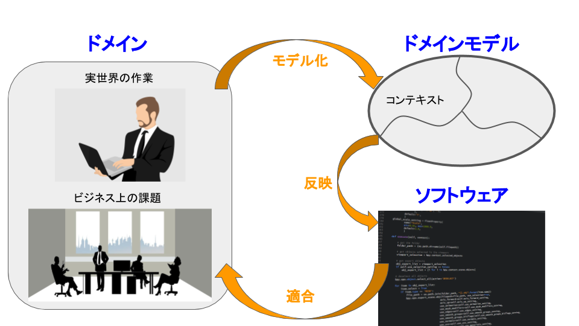
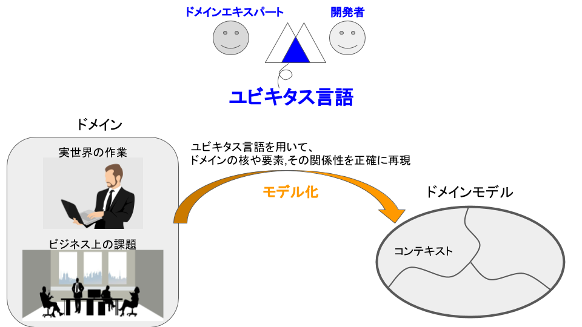
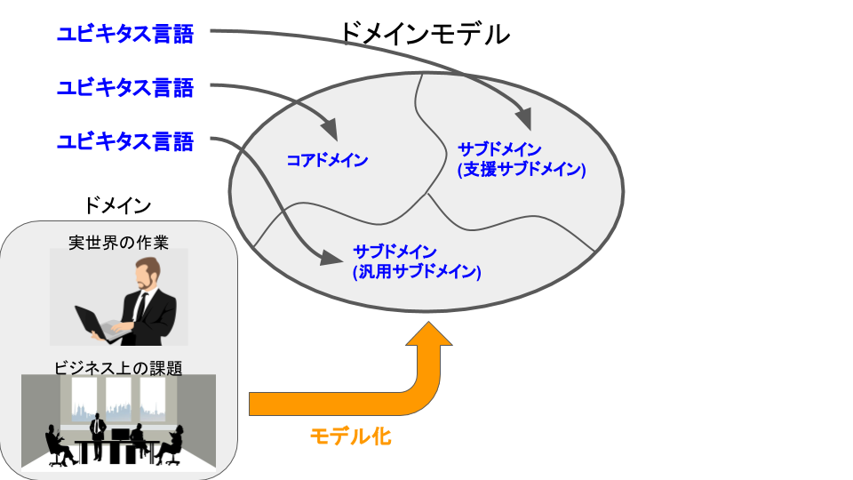
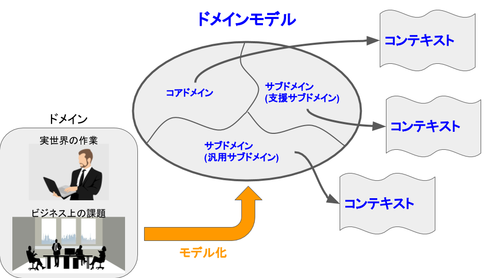
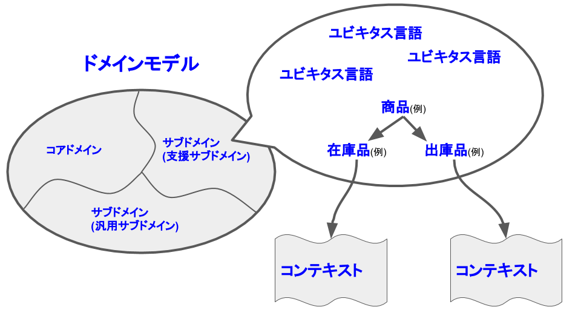

# ドメイン駆動設計

## 目次

<!-- MarkdownTOC -->

- ドメイン駆動設計とは
- ドメインモデルの作成
    - （1）ユビキタス言語の構築
        - 構築方法
        - 構築されたユビキタス言語の評価方法
    - （2）ドメインモデルの設計
        - ドメインモデルの定義
        - コンテキストの定義
    - 分割した「ドメイン」と「境界づけられたコンテキスト」の評価方法
        - ドメイン（問題領域）の評価ポイント
        - 境界づけられたコンテキスト（解決領域）の評価ポイント
- ドメインモデルをコードに反映

<!-- /MarkdownTOC -->

---
## ドメイン駆動設計とは
ドメイン駆動設計（DDD）は、その分野の専門家と開発者が業務を戦略的に理解し、共通の言葉(=ユビキタス言語)を用いてシステムを発展させていく開発手法

 - 具体的には、チームの共通言語である「ユビキタス言語」を用いて「ドメインモデル」を構築し、それをコードとして実装します。
 - また大規模で密結合なシステムにならないように「ドメイン」と「境界づけられたコンテキスト」にてシステムを分割し、「コアドメイン」という最重要領域に集中して開発を行います。

用語

 - 「その分野の専門家」=「**ドメインエキスパート**」
 - 「**ドメイン**」: 分析対象となる**問題領域**
 - 「**ドメインモデル**」 : 対象のドメインをプロジェクトの関係者に向けて表現したもの
    - あくまで、対象のドメインを抽象化したものであるため、そのドメインの全てをモデルに取り込むことはできません

---
## ドメインモデルの作成
### （1）ユビキタス言語の構築
ドメインエキスパートと開発者という異なる専門知識を有する者が協働でドメインモデルを正確に作成するためには、共通言語が必要です。その共通言語のことをユビキタス言語と言います。

ユビキタス言語を使うことでドメインを適切に且つ正確にモデル化したドメインモデルを作成することができます。その結果、開発者は作成されたドメインモデルをそのまま反映したソフトウェアを作成し、ドメインに適合することが可能になるのです。

#### 構築方法

 1. ドメインに登場する**用語**について**名称**と**アクション**を記載する
 2. ユビキタス言語選定のために「**用語集**」を作成する
    - 用語の候補と採用／却下理由を記載する
    - さらに用語の定義を書くことで、ドメインに関連する用語を見つけられる
 3. 用語集の作成が困難な場合は、すでに存在しているドキュメントを集めてきて、重要な用語やフレーズを取り出す

上記作業は一部の人間だけで行ってもかまいませんが、レビューはチーム全体で行います。

ユビキタス言語の候補を見つけたら、そのままソースコードに反映します。

> 例えば「顧客」という用語に「姓名を変える」という振る舞いがあれば、そのままドメインモデルとして実装します。顧客クラスに「姓」や「名」というフィールドを公開するだけではなく、「姓名を変える」というメソッドを実装します。

先ほど作成した図や用語集は、そのうち使用しなくなります。ドキュメントを管理する代わりに「コード内のモデル」と「チーム内での会話」として、ユビキタス言語をメンテナンスし続けます。言い換えれば、ユビキタス言語に含まれない概念はコードにも存在しないことになります。

自分の課題

 - CRM+でユビキタス言語を構築した際に問題だと思ったのは、構築時間が多大であること→どうにか短縮できないか

#### 構築されたユビキタス言語の評価方法

 - 構築されたユビキタス言語が一意な意味になっているだろうか？人によって意味が異なっていることがないだろうか？

### （2）ドメインモデルの設計
ユビキタス言語を構築した後に、それらの言語を使ってドメインモデルを設計します。

#### ドメインモデルの定義

 - 「**コアドメイン**」 : 事業的に最も重要で戦略的に不可欠な部分
    - 優秀なメンバーを参加させ、積極的に成長させビジネス的な差別化を図ります
    - DDDで開発を行う場合、十分に議論を行い、その部分が本当にコアドメインかどうかを確認する必要があります
    - コアドメインと定義した部分にビジネス的な強みが無い場合は、DDDで開発を行うかを再検討する必要があります
 - 「**サブドメイン**」: 「コアドメイン」ではない補助的な部分
    - サブドメインはコアドメインにとって必要な部分となります
    - 当事者の視点によって「コアドメイン」と「サブドメイン」が入れ替わることに注意します
    - ex) ECとERPが含まれるシステムの場合,ERP構築企業の視点ではコアドメインはERPで、サブドメインがECとなります。逆にEC構築企業の視点ではコアドメインはECで、サブドメインがERPとなります
    - **「支援サブドメイン」** : コアドメインほど重要ではないものの、業務的に特別なもの
        - 例えば、コアドメインの支援を行う独自機能などが該当します
    - **「汎用サブドメイン」** : 業務的に特別ではないが、今回のシステムにおいて必要な箇所
        - 例えば、例えば認証機能やERPやECなど
        - 極端な場合、交換されたとしても差し支えのない機能が該当します。

#### コンテキストの定義

**「境界づけられたコンテキスト」とは** 
> ドメインの課題を解決する部分

 - DDDでは、1つの「コアドメイン（もしくはサブドメイン）」に、1つの「境界づけられたコンテキスト」が対応している状態が最適だとされています。
 - ただし、現実の（レガシー）システムでは、複数のドメインに対して1つの境界づけられたコンテキストしか存在しないケースも多々存在します。

**コンテキストの分割** 

> ここでは、システムにおける言葉に注目してみましょう。同じ商品であってもタイミングで呼び名が変わる「ECサイト」の「商品」の例を見てみましょう。
>
| 順番 | 「商品」の取り扱い状態 | 「商品」の呼び名 |
|:----|:--------------------|:---------------|
| 1 | 予約中 | 入荷待ち |
| 2   | 入荷時 | 着荷品 |
| 3   | 販売中 | 在庫品 |
| 4   | 販売後 | 出庫品 |
| 5   | トラブル発生時 | 不良品 |
>
> 「取り扱い状態」の変化によって「商品」の呼び名が変わることがわかると思います。規模が大きいシステムでは、1つの言葉が複数の状態を兼ねてしまうこともあります。しかし、DDDではこのような巨大な「エンタープライズモデル」は設計しません。**「商品」という言語が、2つ以上の意味を持たないように「境界づけられたコンテキスト」を適切に分割**し、プログラムの複雑化を防ぎます。

DDDでは共通言語として「ユビキタス言語」を作り上げ、そのモデルに沿って実装します。そこで、ユビキタス言語の意味が変わる境界で「境界づけられたコンテキスト」を分割して管理します。

 - 「境界づけられたコンテキスト」はユビキタス言語が複数の意味を持たないようにするための明示的な境界
 - この戦略的設計を適切に実行すると、異なる概念がドメインに混ざらないため、シンプルなシステムを構築できます

### 分割した「ドメイン」と「境界づけられたコンテキスト」の評価方法
#### ドメイン（問題領域）の評価ポイント
構築システムの対象ドメインの整理後、以下の項目において評価を行います。

 1. 戦略的コアドメインの名前、ビジョン、検討するべき概念が正しいか
 2. 必要な支援サブドメインと汎用サブドメインの抜け漏れがないか
 3. 各ドメインの担当者を招集可能か

対象とするコアドメインの戦略を理解しているか、関連するサブドメインが適切に洗い出されているかが重要となります。そして、それぞれのドメインエキスパートと協力できる体制になっているかを評価します。

#### 境界づけられたコンテキスト（解決領域）の評価ポイント
境界づけられたコンテキスト」の内容が正しいかを検証する指針は以下となります。

 1. 既存ソフトウェア資産の把握（再利用可否と相互接続状況の調査を含む）
 2. 新規ソフトウェア資産の検討（開発可能かの調査を含む）
 3. 既存ソフトウェアと新規ソフトウェアの統合方法検討
 4. 依存する関連プロジェクトのリスク検討
 5. ユビキタス言語の抜け漏れの確認
 6. 境界づけられたコンテキスト間における「重複または共有しているユビキタス言語」の調査とマッピング方法／変換方法の検討
 7. コアドメインの概念が境界づけられたコンテキストに適切に含まれているか確認

開発を進めるにあたり既存システムと新規システムにおいて必要な情報が集まっているか、連携方針やリスクの洗い出しができているか、ユビキタス言語の洗い出しと連携方法が適切にどのように構築するかを検討できているかがポイントとなります。

繰り返しになりますが「境界づけられたコンテキスト」の検証を行うには、「ユビキタス言語」を確認します。ユビキタス用語の変化に敏感になることで「境界づけられたコンテキスト」が適切に分割されているか分かります。

---
## ドメインモデルをコードに反映

 1. ユビキタス言語をまとめる
 2. ドメインモデル図の作成
 3. ビジネスロジック図の作成
 4. クラス図の作成
 5. シーケンス図の作成
 6. API/バッチ仕様書の作成
 7. 実装
 8. e2eテスト
 9. リリース
