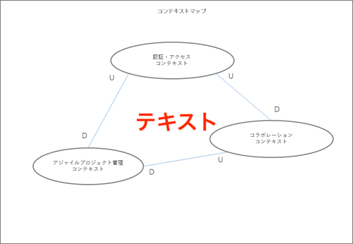
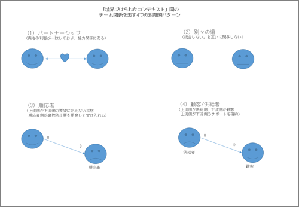
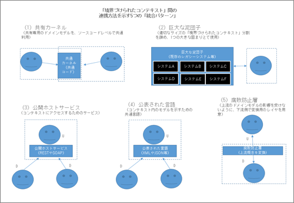

# コンテキストマップ

<!-- MarkdownTOC -->

- コンテキストマップとは
- コンテキストマップの書き方
- コンテキストマップの「組織パターン」と「統合パターン」
    - チームの関係を示す「組織パターン」
    - 境界づけられたコンテキスト間の連携方法を示す「統合パターン」

<!-- /MarkdownTOC -->

## コンテキストマップとは
コンテキストマップとは、複数の「境界づけられたコンテキスト」間の関係を俯瞰する地図

 - システムの全体像や相互関係を把握することができます
 - コンテキストマップは「境界づけられたコンテキスト」を丸で囲み、コンテキスト間の関係を線でつなぐシンプルな図

 - 線の終端には「U」と「D」という文字を書きます
    - U : Upstream（上流）
    - D : Downstream（下流）
 - 上流／下流とは、あるモデルの変更が他のモデルに影響を与える場合、影響を与える側を「上流」、影響を受ける側を「下流」と呼びます。

**コンテキストマップを描く理由** 
> システム間の関係を適切に把握できるから。
>
> コンテキストマップはアーキテクチャ図というよりも、チーム間のコミュケーション関係を示す図の意味合いが強くなります。コンテキストマップは組織間の問題を見つけ出せる唯一のドキュメントとなるため、プロジェクトの成功に不可欠といわれています。

**コンテキストマップを書くタイミング**
> コンテキストマップは、連携するチームとの関係性を示すドキュメントであるため、なるべく**早いうちに**作成することが良いとされています。プロジェクトの早い段階からチーム間の関係を正しく認識し、プロジェクト後半のリスクを軽減させます。
>
> また、コンテキストマップは遠い将来の図ではなく「現時点」の図として記述します。そして機能を追加する時に、随時コンテキストマップを更新します。

**コンテキストマップの共有場所** 
> 作成したコンテキストマップは、チームの作業エリアに掲示しておくと良いといわれています（活発なWikiのポータルがあればそこでも構いません）

## コンテキストマップの書き方

 1. 複数のコンテキストをホワイトボードに書き出す
 2. 境界づけられたコンテキストが適切に分割されているかを検討し、ユビキタス言語が最適になるように修正していきます
 3. 境界づけられたコンテキストの関係性について「組織パターン」と「統合パターン」を確認していきます。

## コンテキストマップの「組織パターン」と「統合パターン」
コンテキストマップにて、境界づけられたコンテキスト間の関係を描く場合には、大きく次の2種類の分類があります。

 - チーム間の関係を示す「組織パターン」
 - データとプログラムの連携方法を示す「統合パターン」

### チームの関係を示す「組織パターン」

 1. パートナーシップ : 2つのチームにおいて協力的な関係が成り立つ場合を「パートナーシップ」の関係と呼びます.
    - 計画から連携試験まで共同でマネジメントを行います
    - チーム間のインターフェイス部を共に検討し、最適な状態になるよう発展させます
 2. 別々の道 : コンテキスト間で統合を行わないことを示します
    - 2つの境界づけられたコンテキストにおいて連携するメリットがない場合に両者につながりが無いことを明確に宣言します
 3. 順応者 : 2つのチーム間において、上流側が下流側の要望を考慮する必要がない状態を「順応者」の関係と呼びます
    - 上流側は下流側の都合を考慮しないため、下流側チームは「腐敗防止層（後述）」を用意して、上流側モデルの変換処理を行います
    - ex) TwitterやFacebookのAPIを使用するアプリを開発する場合、APIの変更などがあったとしても、アプリ側で対応するしか無いため、アプリ開発チームとしては「順応者」の関係になります
 4. 顧客／供給者 : 2つのチーム間において、上流側が供給側、下流側が顧客となるような関係
    - 上流側チームの成否が下流側チームの成否に影響を大きく与える場合、上流側のチームが下流側のチームに対して適切なサポートを行います。そのため、下流チームの要件も考慮して、上流チームが計画や予算を立案します。
    - ex) スマホで独自アプリケーションを開発する場合、API開発チームは「供給者側（上流側）」となり、アプリ開発チームは「顧客側（下流側）」といえるでしょう

### 境界づけられたコンテキスト間の連携方法を示す「統合パターン」

 1. 共有カーネル : 複数ドメインにおいて共有が必要な部分に、共通で使用するドメインモデルを構築してソースコードレベルで共有するパターン
    - 共有カーネルに変更が必要な場合は他のチームの承認が必要となるため、この部分は極力小さくします
 2. 巨大な泥団子 : DDDでは境界づけられたコンテキストを適切な大きさに分割して管理します。しかし既存システムが大規模で複雑な場合、そのまま大きな固まりとして捉えることを「巨大な泥団子」と呼びます
    - 連携システムを巨大な泥団子とみなす場合、自分たちの「境界づけられたコンテキスト」に「巨大な泥団子」のモデルが侵食してこないよう注意します
 3. 公開ホストサービス（OHS：Open Host Service）: 「境界づけられたコンテキスト」の内容にアクセスできる公開サービス
    - 最近ではREST形式のWebサービスが主流となっています。
    - 公開されたサービスを利用するクライアントは複数存在していても問題ありません。新しい機能を提供する場合は、公開サービスを拡張します
    - ただし、特定のクライアントしか使用しない場合は、特定クライアント向けのサービスを公開します
 4. 公表された言語（PL：Published Language）: 2つの境界づけられたコンテキスト内のモデルを変換する場合、共通の言語が必要となります。これを「公表された言語」と呼びます
    - 最近ではJSONとXMLがよく使用されています
    - ドキュメントにより定義された共有言語であり「公開ホストサービス」と組み合わして使用されることが一般的です
 5. 腐敗防止層（ACL：Anti Corruption Layer） : 連携する2チームの関係が良好な場合は適切な変換層が用意されることになりますが、連携先のチームの協力を仰げない場合は「腐敗防止層」を作成します
    - 下流側のチームは、上流側の機能を自コンテキストのドメインモデルとして変換するために「腐敗防止層」というレイヤを作ります
    - データを「受信」する場合と「送信」する場合の両方のケースが存在します
    - このレイヤでは、2つのコンテキスト間のモデル変換を双方向に行います
