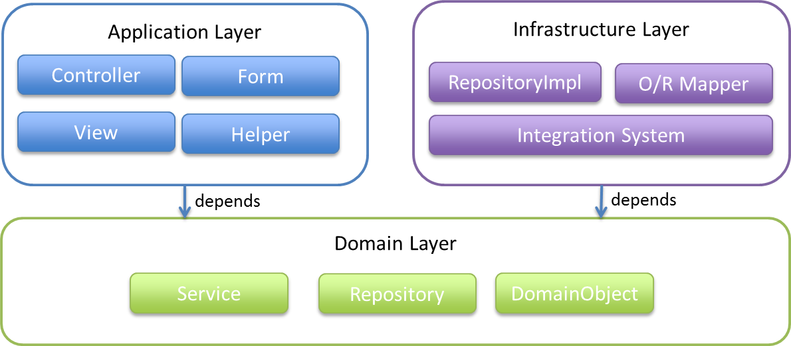
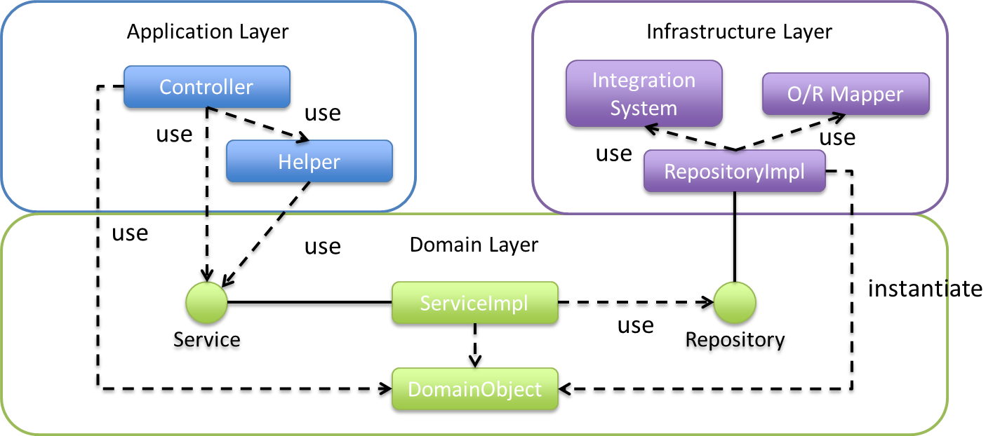
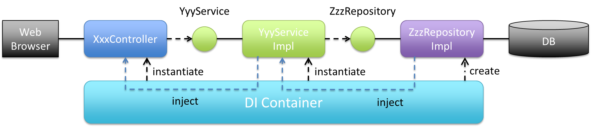
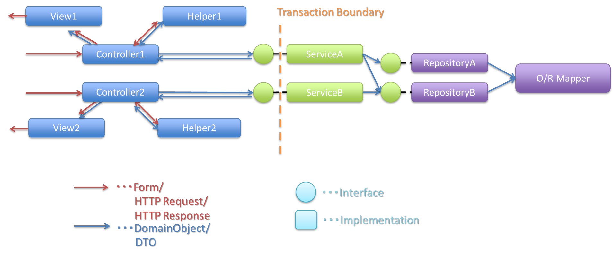

# レイヤアーキテクチャ
幾つかの層に分割してシステムを構築するパターンです。 
昔ながらのN層システムと呼ばれる、2層（クライアントアプリ→DB）や3層（ブラウザ→Webサーバー→DB）もレイヤアーキテクチャの一種です。

このアーキテクチャのポイントは、ライブラリや名前空間を分割することに加え、各レイヤの依存関係を明確にして、適切な責務に沿って実装することが重要となります。

## DDD×レイヤアーキテクチャ
DDDとレイヤアーキテクチャを組み合わせた場合の各レイヤの特徴については以下の通りです。

| レイヤ | 説明 |
|:-----:|:-----|
| UI層 | ドメイン層のモデルを使うことも可能ですが、描画での使用のみにしておくことが推奨されています。可能であれば、ドメインがビューの影響を受けることを防ぐために「プレゼンテーションモデル」を作ります。 |
| アプリケーション層 | UI層から使用されます。ここには「アプリケーションサービス」が存在します。アプリケーションサービスは「ドメインサービス」と異なり、ドメインロジックを持たず軽量なコーディネーターのような役割を果たします。 |
| ドメイン層 | ユースケースやユーザーストーリーを実装します。ドメインモデルが提供され、「ファクトリ」か「集約」のコンストラクタにてインスタンスを生成します。ドメイン層には「ドメインサービス」が含まれ、ステートレスな操作として、ドメインの操作を行います。また、イベント駆動の場合「ドメインイベント」を発行します。 |
| インフラストラクチャ層 | 「リポジトリ」を使用して永続化を行います。 |

DDDの各要素については、別の資料にまとめてあります。ここでは構成イメージだけ把握してください。

---
## レイヤの定義

> **ルール**
>
> - アプリケーション層も、インフラストラクチャ層も、ドメイン層に依存するが、<strong style="color: blue;">ドメイン層が他の層に依存してはいけない</strong>
> - ドメイン層の変更によって、アプケーション層に変更が生じるのは良いが、アプリケーション層の変更によって、ドメイン層の変更が生じるべきではない

> **入力から出力までのデータの流れ**
>
> アプリケーション層→ドメイン層→インフラストラクチャ層

### アプリケーション層
> 情報の入出力となるUIを提供したり、リクエスト情報をドメイン層や他のシステムから呼び出し、表示用の出力を返す手続きを行うなどアプリケーションを構築するための層である。<strong>この層は、できるだけ薄く保たれるべきであり、ビジネスルールを含んではいけない。</strong>

| コンポーネント | 説明 |
|:------------:|:-----|
| `Controller` | 基本的には、リクエストを処理にマッピングし、結果をViewに渡すという画面遷移やセンション管理を担う。主処理は、Controller内では行わず、ドメイン層のServiceを呼び出す。Spring MVCでは、`@Controller`アノテーションがついた、POJOクラスが該当する。 Controllerの結果がView(の論理名)になる。 |
| `View` | クライアントへの出力を担う。JSP/PDF/Excel/JSONなど、様々な出力結果を返す。Spring MVCでは、Viewクラスが該当する。 |
| `Form` | 画面のフォームを表現する。フォームの情報をControllerに渡したり、Contollerからフォームに出力する際に用いられる。ドメイン層がアプリケーション層に依存しないように、FormからDomain Object(Entity等)への変換やDomain ObjectからFormへの変換は、アプリケーション層で行う必要ある。 |
| `Helper` | Controllerを補助する役割を担い、Application層とDomain層のモデル相互変換など、Controller本来の処理以外の処理を行う。Helperはoptionであり、必要に応じて、POJOクラスとして作成すること。 |

### ドメイン層
> ドメイン層は、アプリケーションのコアとなる層である。ビジネス上の解決すべき問題を表現し、ビジネスオブジェクトや、ビジネスルールを含む(口座へ入金する場合に、残高が十分であるかどうかのチェックなど)。ドメイン層は、他の層からは疎であり、再利用できる。

| コンポーネント | 説明 |
|:------------:|:-----|
| `Domain Object` | エンティティ,値オブジェクト,集約 |
| `Repository` | Domain Objectの格納・取得や、作成、更新、削除のようなCRUD処理を担う。この層では、インタフェースのみ定義され、実体は、インフラストラクチャ層のRepositoryImplで実装されるため、どのようなデータアクセスが行われているかについての情報は持たない。 |
| `Service` | ドメインサービスのこと |

### インフラストラクチャ層
>
> - インフラストラクチャ層では、ドメイン層(Repositoryインタフェース)の実装を提供する。
> - データストア(RDBMSや、NoSQLなどのデータを格納する場所)への永続化や、メッセージの送信などを担う。

| コンポーネント | 説明 |
|:------------:|:-----|
| `RepositoryImpl` | RepositoryImplは、Repositoryの実装であり、Domain Objectのライフサイクル管理を隠蔽する。これにより、ドメイン層がどのようにデータアクセスされているか意識しなくて済む。Spring Data JPAを使用する場合は、Spring Data JPAが実体を(一部)自動で作成する。 |
| `O/R Mapper` | データベースとEntityの相互マッピングを担う。JPAや、MyBatis, Spring JDBCが本機能を提供する。 |
| `Integration System Connector` | メッセージングシステムや、Key-Value-Store、Webサービス、既存システムなど、データベース以外のデータストア、あるいは外部システムとの連携を担う。Repositoryの実装に用いられる。 |

---
## レイヤ間の依存関係
ドメイン層がコアとなり、アプリケーション層、インフラストラクチャ層がそれに依存する形となる。

各レイヤのオブジェクトの依存関係は、DIコンテナによって解決される。

入力から出力までの流れで表現すると、次の図のようになる。

---
## プロジェクト構成
https://terasolunaorg.github.io/guideline/public_review/Overview/ApplicationLayering.html#application-layering-project-structure