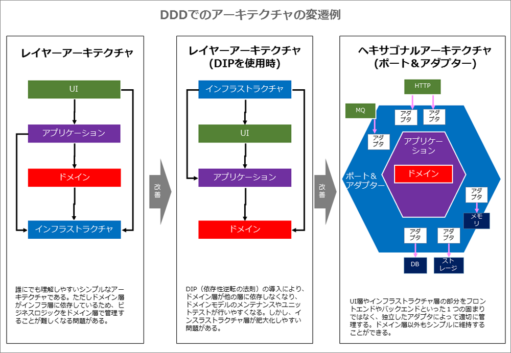
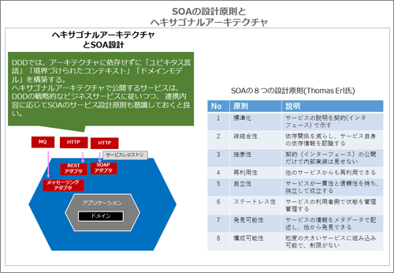
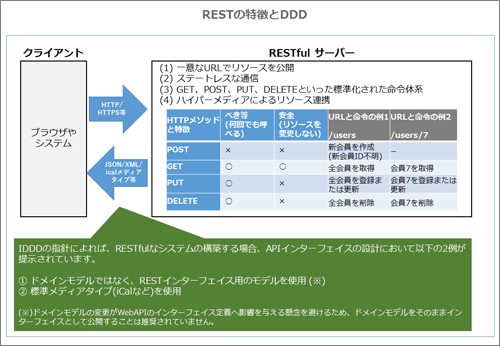

# アーキテクチャ
DDDは特定の技術に依存していないため、自由にアーキテクチャを選択することができます。アーキテクチャの選定においては、構築するシステムに求められる「機能要求（ユースケース、ユーザーストーリー、ドメインモデルのシナリオ等）」と「品質要求（性能、エラー制御、SLA、リアルタイム性等）」が大きな判断材料となります。最適なアーキテクチャを選択することは、プロジェクト成功に向けて重要なポイントとなります。

## 目次

<!-- MarkdownTOC -->

- 依存性逆転の原則\(DIP\)を用いたレイヤアーキテクチャ
- ヘキサゴナルアーキテクチャ
    - 【ヘキサゴナルアーキテクチャ】サービス指向のアプローチ
    - 【ヘキサゴナルアーキテクチャ】ヘキサゴナルで使用されるREST
- コマンドクエリ責務分離（CQRS:Command Query Responsibility Segregation）
    - コマンドクエリ責務分離とは
    - DDDにおけるCQRSでの流れ
    - CQRSでの同期／非同期の採用指針
    - CQRSと結果整合性
- イベント駆動アーキテクチャ
    - 例) 電話番号一覧から条件一致する件数を探すサンプル
    - 【イベント駆動アーキテクチャ】「パイプ&フィルター」
    - 【イベント駆動アーキテクチャ】「長期プロセス\(サーガ\)」
    - 【イベント駆動アーキテクチャ】「イベントソーシング」
    - 【イベント駆動アーキテクチャ】データファブリック（グリッドベース分散キャッシュ）

<!-- /MarkdownTOC -->

## 依存性逆転の原則(DIP)を用いたレイヤアーキテクチャ
> SaaSOvationチームは、複雑化するソフトウェアにユニットテストツールを用いて品質改善対応をする際にDIPを導入しました。Robert C. Martin氏が提唱したDIP（依存性逆転の原則：Dependency Inversion Principle）とは「上位が下位に依存する従来の形をやめ、抽象が詳細に依存するのではなく、実装が抽象に依存するべき」という指針です。プログラムの実装としては、依存性の注入（DIコンテナ）、サービスファクトリ、プラグインなどの方式が使用されます。

例えば、インフラストラクチャの実装にドメインが依存するのではなく、ドメインの抽象（インターフェイス）に対してインフラストラクチャの実装が依存する形になります。これは前述のレイヤアーキテクチャと逆の依存関係が成り立つため、依存性逆転と呼ばれます。

**このアーキテクチャでは、ドメインが他のレイヤに依存しなくなるため、ドメイン層を独立させ、シンプルに管理しやすくなります**。

---
## ヘキサゴナルアーキテクチャ
> DIPの採用でドメインの独立性は高まりますが、**インフラストラクチャ層の実装は複雑になりがちです**。そこでSaaSOvationチームでは、NoSQL／メッセージングといった新しい永続化技術の導入時に「**ヘキサゴナルアーキテクチャ**」を導入しました。

ヘキサゴナルアーキテクチャとは、「アプリケーション（ドメイン）層を中心に捉え、ユーザー操作／自動テストといった入力側もデータベース／モックといった出力側も、全てまとめて差し替え可能な外部インターフェイスとして扱う」という考え方です。

レイヤアーキテクチャでは、上位（もしくはフロントエンド）と下位（もしくはバックエンド）という「非対称性」な構成でしたが、ヘキサゴナルアーキテクチャでは、ドメインを中心において「処理を駆動するプライマリ」側と「処理が駆動されるセカンダリ」側と連携します。例えば、何かの処理がある場合、プライマリ側（左上部分）のアクションによってドメインが呼び出されます。そして、セカンダリ側（右下部分）によって保存したりイベントを生成したりします。この「対称性」なイメージを想起させるためヘキサゴンなアーキテクチャ（六角形なアーキテクチャ）と命名されました。

**ヘキサゴナルを構成する「ポート＆アダプタ」** 
ヘキサゴナルアーキテクチャは、構成上の仕組みから「ポート＆アダプタ」とも呼ばれます。システムの目的に応じて「ポート」が設計され、技術的に差しかえが可能な部分が「アダプタ」として用意されます。「ドメイン」部分は機能やユースケースを基に設計し、「ポート＆アダプタ」部分は技術的なインターフェース別で設計するイメージとなります。

例としては、永続化機能のポートにおいて、実データベースを使うアダプタと自動テスト用モックを使うアダプタを用意します。将来的にはNoSQLやクラウドストレージ用のアダプタが追加されるかもしれません。

**ヘキサゴナルアーキテクチャのメリット** 
ヘキサゴナルアーキテクチャのメリットは、**柔軟なアーキテクチャのため、他のアーキテクチャもうまく取り込むことができることです。また、周辺の技術が決まっていなくても、暫定的にアダプタを作成し、ドメインの開発を進められます。さらに上手に設計すると、ドメイン層のロジックが外部に漏れなくなり、ユースケースを適切に実装できます**。

DIPのレイヤアーキテクチャを用いている場合は、ヘキサゴナルな要素が少なからず含まれていますので、ヘキサゴナルアーキテクチャに変更することを検討してみると良いでしょう。

### 【ヘキサゴナルアーキテクチャ】サービス指向のアプローチ
例）
> SaaSOvationチームは、レガシーなコラボレーションツールからの移行用サービスを作成するにあたり、ESB Muleという製品を導入しました。ESB（エンタープライズサービスバス）とは、コードを書かずにメッセージング基盤を提供するミドルウェア／インフラ製品で、SOAの機能も提供されています。

**SOA（Service Oriented Architecture：サービス指向アーキテクチャ）の導入** 
SOA（Service Oriented Architecture）とはサービス指向アーキテクチャのことで、ソフトウェアをサービスとして連携させ、システム全体を構築していきます。ヘキサゴナルアーキテクチャのサービス設計において、SOAの設計指針を意識することは有益です。

サービス設計の指針としては、ビジネス戦略を示す「ビジネスサービス」とREST／SOAP／メッセージ型といった「技術的サービス」の両面を意識します。さらにDDDでは「ユビキタス言語」や「境界づけられたコンテキスト」が不自然に分断されていないかをチェックすることで、より良いサービスを公開できます。

### 【ヘキサゴナルアーキテクチャ】ヘキサゴナルで使用されるREST
DDDでWebサービスを構築する時によく利用される技術がRESTです。SaaSOvationチームは、モバイル対応、認証管理、BIレポートの対応において、RESTを採用しました。

**REST（Representational State Transfer）fulなシステムとは** 

 1. **リソースを一意なURIで識別可能** : ex)`client_id/product_id/search?q=hoge`
 2. **ステートレスな通信** : RESTfulなHTTPサーバーは前回のリクエストの状態などを記憶しないため、各HTTPメッセージには、そのリクエストを処理するために必要な情報が全て含まれています
 3. **GET／POST等の命令指針に基づいたリソース操作** : RESTでは「GET（取得）」「POST（登録）」「PUT（登録または更新）」「DELETE（削除）」等のHTTPメソッドを用いてリソースを操作できます
 4. **関連リソースへのナビゲーションを扱う「ハイパーメディア」** : RESTでは、ハイパーメディアを用いて、レスポンスの中に他のリソース情報を埋め込むことができます

**DDDでRESTの使用** 

 - RESTは理解が容易で、疎結合で利用がしやすい仕組みのためスケーラブルなサービスの提供にも適しています
 - 上記の性質からDDDのヘキサゴナルアーキテクチャとの相性も良いとされています。
 - RESTで公開するインターフェイスは、コアドメインをそのまま公開するのではなく、公開用の独自モデルを設計するか、ical（一般的なカレンダー形式）のような汎用的なメディアタイプを使用することが推奨されています

---
##コマンドクエリ責務分離（CQRS:Command Query Responsibility Segregation）

### コマンドクエリ責務分離とは

 - CQRSパターンの元になっている原則は、コマンドとクエリを分解するアーキテクチャパターンであるCQS（Command Query Separation）. CQSの特徴は↓
    1. **コマンド（ライト）** : オブジェクトの状態を変更するメソッドは値を戻してはいけない。戻り値の型はVoidである。
    2. **クエリ（リード）** : メソッドが型や値を戻す場合、オブジェクトの状態を変更してはいけない。

従来のプログラミングでは、更新と取得を同じメソッドで記述していたかもしれませんが、CQRSでは「更新メソッド」と「結果取得メソッド」として明確に2つに分離します。

### DDDにおけるCQRSでの流れ
上図に従い、CQRSの流れを見ていきましょう。

**(1) コマンドの処理（コマンドプロセッサ/コマンドハンドラ）** 
サーバー側にて更新処理を開始します。この処理部分は、コマンドプロセッサ（コマンドハンドラ）と呼ばれます。このコマンドプロセッサの構築方法については、次の3方式があります。

同期処理の場合

 - (a)分類方式（アプリケーションサービスに複数のコマンドメソッドを追加）: 開発が容易
 - (b)専用方式（単一メソッドを持つ単一クラスを作成）: コマンドごとの責務が明確になる

非同期処理の場合

 - (c)メッセージング方式 : 「専用方式」のコマンドクラスを非同期のメッセージとして送信します.複雑になるためスケーラビリティが必要な場合のみ選択するようにします

どの方式にせよ、コマンドプロセッサは、コマンドモデルである集約のインスタンスを作成／取得し、更新用のメソッドを実行します

**(2) コマンドモデル（ライトモデル）** 
通常、集約がコマンドモデルとなります。コマンドモデルの更新系メソッドが呼び出される場合、最後に「ドメインイベント」が発行されます。例えば「会員が登録された時」というようなイベントを発行します。

**(3) コマンドモデル用データストア** 
コマンドモデルの更新結果が保存されます。データの更新内容がレポジトリ経由で格納されます

**(4) コマンド処理を実行（イベントのサブスクライバ）** 
サブスクライバ（購読者）が発行されたドメインイベントを受信します。そして、受け取ったイベントの内容に従ってクエリモデル（クエリ用のデータ）の更新を行います。

**(5) クエリモデル用データストア** 
クエリモデル用データストアには、描画用のデータが格納されています。

 - データの格納場所の決まりはありませんが、データベースのテーブルが一般的
 - 高速化のため事前にテーブルをジョインして非正規化した「マテリアライズドビュー」を使用する場合もある
 - マテリアライズドビューはデータベースの標準機能を使用する場合もありますし、プログラムで事前にデータを構築する場合もあります。また、性能の観点から複数台のレプリカを持つ場合もあります

**(6) クエリモデル（リードモデル）** 
クエリモデルは、画面表示や印刷用のための非正規化されたデータモデルです。

**(7) クエリ処理（クエリプロセッサ）** 
データベースの結果セットをそのままかJSON／XMLで戻したり、DTO（データトランスファーオブジェクト）という描画モデルに詰め替えたりします。これらの方式については、プロジェクトにおいて最適な方法を選択します。

上記の流れでCQRSによるデータの更新と描画が可能となります。

### CQRSでの同期／非同期の採用指針
CQRSで同期的に処理するか、非同期に処理するかは機能要件次第です。

 - 同じDB内に「コマンドモデル用データストア」と「クエリモデル用データストア」を用意し、同一のトランザクションを用いれば同期的に処理することができますが、処理時間がかかる.
 - 非同期処理を用いる場合は、いったんレスポンスを返せるため高速になりますが、一貫性が保たれないため「結果整合性」を保つ必要があります。

### CQRSと結果整合性
「結果整合性」とは「結果として一貫性が保たれることが保証されていれば問題ない」という考え方です。

標準的なRDBMSアプリケーションでは、ひとつの処理でビジネスルールを正しく保つ「トランザクション整合性」が一般的（例：銀行口座の入出金では必須）です。しかし、DDDではドメインエキスパートの観点から、最終的に一貫性が保たれれば多少のタイムラグが合っても問題がないと判断される場合、「結果整合性」を用いることで複雑性を排除することができます。

非同期のCRQSでは結果整合性は保たれますが、クエリモデルの更新までに多少のタイムラグが発生します。これを補完するためアプリケーション側で、更新依頼したユーザーに対して入力データを使った疑似的な画面更新を行ったり、データの最終更新時刻を表示したりといったUI対策を実施する場合があります。さらにリアルタイムな更新が必要な場合は、サーバー側からプッシュする技術（Commet／WebSocket／Server Sent Events等）の採用を検討する場合もあります。

---
## イベント駆動アーキテクチャ
イベント駆動アーキテクチャ（EDA:Event Driven Architecture）とは、**イベントを待機し、起こったイベントに応じて処理を行うプログラムスタイル**です。

> SaaSOvationでは、ユーザーに待ちが発生したり、タイムアウトが発生したりするような、長いタスクへの対策としてイベント駆動アーキテクチャを導入しました。

 - ヘキサゴナルアーキテクチャの場合、複数ドメイン間で連携を行うような分散処理に適しています
 - システムが複数存在する場合、イベントを使うことで複数のシステム間の結合を切り離すことができます
    - 例えば、あるシステムの変更をドメインイベントとして、他システムのイベントサブスクライバに連携することができます

イベント駆動アーキテクチャの一覧

 - 「パイプ&フィルター」
 - 「長期プロセス(サーガ)」
 - 「イベントソーシング」

### 例) 電話番号一覧から条件一致する件数を探すサンプル
> サンプルとして、電話番号の一覧が書かれたテキストファイルから、フリーダイヤルの件数を出力する処理をイベント駆動のイメージで考えてみましょう。UNIXコマンドでは「`$cat 電話番号.txt | grep 0120- | uc -l`」で実現されます。下図では、この処理を「パイプ＆フィルター」方式で表現しています。また、電話番号リスト全体の件数算出を並行して行う例を「長期プロセス（サーガ）」方式にて表現しています。

### 【イベント駆動アーキテクチャ】「パイプ&フィルター」
イベント駆動のシンプルな形が「パイプ＆フィルター」といわれるスタイルとなります

> 上図では、電話番号が記載されたリストがイベントとして渡り、それぞれの処理でフィルターしたり件数を数えたりしていることがわかると思います。

「パイプ」は土管の流れで、次に渡す「イベント」を表しています。「フィルター」は受信したイベントに応じて単一のタスクを実行するコンポーネントです。このパイプとフィルターを組み合わせることでパイプラインを構築します。

### 【イベント駆動アーキテクチャ】「長期プロセス(サーガ)」
パイプ＆フィルターでは、ひとつのパイプラインを対象としていましたが、処理速度の向上のため、複数パイプラインを並列実行したい場合があります。このようなケースでは「長期プロセス（サーガ）」方式を用いることで、並列にパイプラインを制御できます。

 - メリット) 長期プロセスは、柔軟性が高く並列実行もできるアーキテクチャーのため、他システムやレガシーシステムとの統合といった高度な連携時に採用可能です
 - デメリット) 長期プロセス方式では、各パイプラインの状態制御に注意を払う必要があります
    - ex) インフラやアプリケーションの障害からの復旧、能動的／受動的タイムアウトの管理、重複イベントのメッセージ管理といった制御が必要になります
    - 正常なユースケースだけではなく、失敗を想定したワークフローも組み込む必要があるため、難易度は高くなります

### 【イベント駆動アーキテクチャ】「イベントソーシング」
> SaaSOvationチームは、政府からの監査対応のためにイベントソーシングを導入しました。このような履歴管理のような要件には「イベントソーシング（Event Sourcing）」というパターンを使用できます。これは、GitやSubversionといったピンポイントで過去の状態に復元できるリビジョン管理ツールの概念に似ています。

イベントソーシングの流れは、上図の通り、**発生したすべてのイベントを「イベントストア」に格納する点が特徴**です

 - 記録されたイベントを最初から順番に再生することでオブジェクトの状態を復元できるため、監査やバグ調査において力を発揮します
 - またイベントストアを使って、データパッチを追加することも可能です
 - 状態が変化した理由や経緯が記録されるというメリットはありますが、モデリングや実装において少なからず影響を与えるため、ビジネス的なメリットが必要な場合に採用を検討してみると良いでしょう

### 【イベント駆動アーキテクチャ】データファブリック（グリッドベース分散キャッシュ）
最後に、イベント駆動アーキテクチャの基盤例として、データファブリック（グリッドベース分散キャッシュ）についてまとめます。これは一般的な技術というよりは、Pivotal社のGemFireやOracle社のCoherenceといった特定の製品で提供されている概念となります。この仕組みには次のような特徴があります。

 - ドメインオブジェクトを永続化してキャッシュに保存
 - マルチレプリケーションにより性能面での管理が容易
 - イベント駆動における送信保証のサポート
 - キャッシュ変更時のプッシュ通知（ビューの即時変更）
 - 長期プロセスのような分散並行処理の管理

実装時にこれらの要件が必要になった場合は、この機能についても調査してみると良いでしょう。