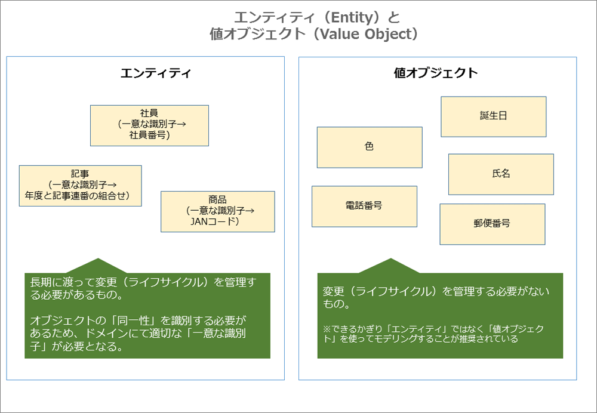
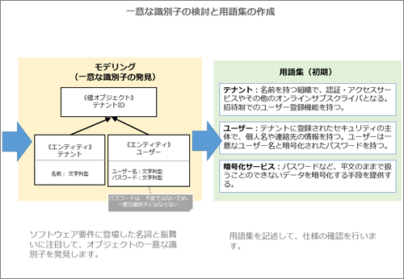
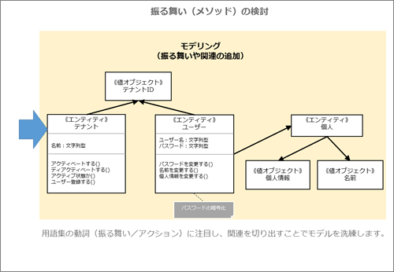

# エンティティ

<!-- MarkdownTOC -->

- エンティティとは
- エンティティの設計
- エンティティの実装
    - 一意な識別子の生成
    - エンティティのメソッドを実装
    - エンティティの生成
    - バリデーションの実装
        - 属性のバリデーション
        - オブジェクト全体のバリデーション
        - 複数オブジェクトの組み合わせ時のバリデーション
    - エンティティの変更管理

<!-- /MarkdownTOC -->

## エンティティとは
DDDにおける「エンティティ」とは一意なものを表現する概念です。

 - 一意であるため、長期にわたって変化できるオブジェクトとなります

> 例えば「社員」というエンティティの場合、**社員番号**で社員を一意に識別することで、同じ人物であることを把握し、住所や所属といった属性を適切に**変更**できます。

 - 一意に識別して変更を管理する必要がないものは「値オブジェクト」として取り扱います



**DDDでよくある失敗**<br>
> DDDで設計を始めてみると、データの格納方法ばかり気になってしまうことがよくあります。このようなERモデリング（テーブル構成とリレーション関係）を先に検討されたエンティティは、DB項目のプロパティしか存在しない機能不足なモデル「ドメインモデル貧血症」になりがちです。ドメインモデル貧血症とは、オブジェクト指向設計の基本である「データと処理を一緒に取り扱う」ことを行わない、単なる手続き型設計のことです。一見、ドメインモデルと同じような構造を持ちつつも、オブジェクトの「振る舞い」が不足している状態を指します。
>
> そのため、DDDで設計する場合には、DOA（データ中心アプローチ）のようにデータ中心で検討するのではなく、OOA（オブジェクト指向アプローチ）のような振る舞いも含めたモデルから検討する方法が適しています。
>
> また、エンティティは「オブジェクトの区別が必須」であるケースにおいて使用する概念です。しかし実際には、<font color="red">値オブジェクトで十分なものをエンティティとして設計してしまう失敗があります</font>

---
## エンティティの設計

<strong>【1】ソフトウェア要件の理解</strong><br>
設計を始めるにあたり、まず業務内容から整理していきます。開発する対象業務について、ドメインエキスパート(その分野の専門家)から要望を聞き出していきます

<strong>【2】モデリングを検討しエンティティを抽出</strong><br>
次に、チームで共通のユビキタス言語を構築することを意識して、ドメインエキスパートと十分な議論を行います。（ユビキタス言語の見つける流れは「戦略的設計」で説明しました。）

エンティティの抽出方法は、シナリオにおいて「<strong style="color:blue;">変更</strong>」というキーワードがある箇所に注目します。主語の用語がエンティティとなる可能性が高くなります。

<strong>【3】エンティティを識別する属性と振る舞いを検討</strong><br>
エンティティに注目してモデリングを行います。

 - エンティティ設計の初期段階では「**エンティティを一意に特定する属性と振る舞い**」にだけ注目します。
 - 同時に用語集を作成し、ユビキタス言語についてドメインエキスパートと認識を合わせます



<strong>【4】「一意な識別子」の設計</strong><br>
エンティティを識別する「一意な識別子」を検討します.

一意な識別子の生成方法

 - ユーザーが「入力」
 - アプリケーションが「生成」
 - 永続化メカニズム（DB）が「生成」
 - 他の境界づけられたコンテキストから「割り当て」

> SaaSOvationでは
>
> - テナントは「テナントID」と「テナント名」
> - ユーザーは「テナントID」と「ユーザー名」
>
> を一意な識別子としています。
>
> なお、テナントIDは別の境界づけられたコンテキストを含む他のオブジェクトから参照されるため、独立した「値オブジェクト」として設計しています。


<strong>【5】エンティティのメソッドを検討</strong><br>
続いて、エンティティが持つ振る舞いについて検討していきます。ソフトウェア要件に登場する**動詞**に注目することで、メソッドの候補を洗い出していきます。



ここでは、テナントに対して「アクティブ状態を示す属性」を追加するのではなく、「アクティベートする」「ディアクティベートする」といったビジネス用語をそのまま振る舞いとして追加しています。これはDDDの設計パターンの1つである「意図の明確なインターフェイス」の考え方に従っています。

> 意図の明確なインターフェイスとは、クラス名やメソッド名に、その効果と目的に関する名前をつけて意図が正確に伝わるようにすることです。利用者がインターフェイスの中身を意識しないで済むように、実装方法や手段を名前に含めないようにします。また、振る舞いを実装する前にテストを書くことにより、利用者の視点で設計を行うようにします。

エンティティでは同一性を識別する本質に絞り込むことが重要であるため、それ以外は別のオブジェクトとしてモデリングしています。ここでは「ユーザー」から「個人」というエンティティを切り出し、「個人情報」という値オブジェクトを追加しています


---
## エンティティの実装

### 一意な識別子の生成

<strong>一意な識別子の生成方法</strong><br>
一意な識別子を決定したら、一意な識別子の生成方法について検討します。

> 生成パターンの一覧
>
| 概要 | 値の例 | メリット | デメリット |
|:----|:-------|:--------|:---------|
| ユーザーが「入力」 | `USR123` | 識別子を生成する仕組みが不要 | 重複せず適切な識別子を利用者に登録してもらうワークフローやチェックの仕組みが必要 |
| アプリケーションが「生成」 | `912649a0-0ed2-4071-8af6-1a350d4adbd0` | UUID(GUID)の生成アルゴリズムを用いて一意な値を軽量に生成 | 人間には理解しがたい文字列（そのため、通常は利用者には非表示） |
| 永続化メカニズム（DB）が「生成」 | `10001` | Oracleのシーケンス等の仕組みを用いて連番を簡単に生成 | DB依存が高く性能面の課題がある |
| 他の境界づけられたコンテキストから「割り当て」 | `USR123`やUUID等 | 識別子生成の仕組みを他のコンテキストに託せる | 他のコンテキストに対して識別子を取得するための検索／マッチング／割り当ての仕組みが必要 |

上記のパターンからエンティティに適した生成方法を選択します。

<strong>一意な識別子の生成タイミング（早期、遅延）</strong><br>
次に、一意な識別子の生成タイミングについて紹介します。生成タイミングについては、「早期生成」と「遅延生成」の2パターンが存在します。

> 一意な識別子の生成タイミング
>
| 概要 | メリット | デメリット |
|:----|:--------|:----------|
| 早期生成(オブジェクト作成時に生成) | オブジェクト作成と同時に識別子を使用可能 | DBから識別子を生成する場合は、オブジェクト生成時にリポジトリ経由でDBから識別子を取得する必要がある |
| 遅延生成(オブジェクト保存時に生成) | 昔ながら生成方法で、馴染みやすい | オブジェクト生成時にドメインイベントを発行させる場合に、一意な識別子が存在しない。またオブジェクト生成時に識別子が未設定（nullや0）のためオブジェクト間の比較に失敗する |


### エンティティのメソッドを実装

<strong>一意な識別子で、エンティティの「同一性」を判定（equals/hashCodeメソッド）</strong><br>
> エンティティが同じかという「同一性」を判定する場合、一意な識別子を使ってオブジェクト同士を比較します。
>
> 従来のシステム開発ではDB保存時にIDを生成する「遅延生成」が多かったと思います。しかし<strong style="color:red;">遅延生成の場合、一意な識別子にデフォルト値（nullや0）が設定されているため、異なるオブジェクトが同一と判定されてしまう問題があります</strong>。この問題に対応するには、遅延生成をやめるか、早期生成でも問題ないようにequalsメソッドとhashCodeメソッドをオーバライドして、識別子以外で同一性を判断できるようにする必要があります。


<strong>一意な識別子を変更しない「不変性」</strong><br>
> 注意点として、**<font color="red">一意な識別子を設定した後は、その識別子の値を変更しないようにします</font>**。もし、識別子が設定済みにもかかわらず、変更処理が呼び出された場合はエラーとなるようにしなければいけません。通常は、一意な識別子のアクセサメソッド（セッター）にアサーションを記載します。


<strong>O/Mマッパー用のID項目「代理識別子」</strong><br>
> なお、最近の実装ではDBにアクセスするライブラリとして、HibernateやEntity FrameworkといったO/Rマッパーを使用することも多いと思います。「代理識別子」とは、O/Rマッパーが使用するシステム的な識別子のことです。


<strong>「レイヤスーパータイプ」で共通処理を実装</strong><br>
> 代理識別子（システム上のキー）は一意な識別子（ビジネス上のキー）ではないため、<strong style="color:blue;">外部から見えないようにしておくことが望ましいです</strong>。代理識別子を外部から見えなくする方法として、レイヤ共通の処理を記述する「レイヤスーパータイプ」を導入することができます。


<strong>コンストラクタから「自己カプセル化」での呼び出し</strong><br>
> コンストラクタの引数に渡された値が、不正でないことを保証するため、適切にバリデーションチェックを行う必要があります。この時、コンストラクタから直接フィールドにアクセスするのではなく、セッターを呼び出すことで、不正な値を防ぐことができます。
>
> このような、クラス内部からのアクセスもアクセサメソッド経由で行うことを「自己カプセル化」とマーティン・ファウラー氏は呼んでいます
>
```java
public class User extends Entity {
    public User(Username username) {
        this.setUsername(username);
    }
}
```


### エンティティの生成

<strong>コンストラクタ</strong><br>
これまで説明してきたように、エンティティは一意である必要があります。そのため、<strong style="color:blue;">エンティティのコンストラクタでは「識別子の生成に必要な情報」や「問い合わせを行うために必要な情報」を引数として渡します</strong>。これにより、エンティティ生成時からオブジェクトを一意に特定できるようになります。

<strong>ファクトリ</strong><br>
もし、エンティティの生成が複雑な場合はコンストラクタを直接呼び出すのではなく、ファクトリを使用します.

> 例えば、ユーザーエンティティの場合、テナントの「ユーザー登録する」メソッドがファクトリとなります。テナント経由でユーザーの作成を行うことで、オブジェクトの状態を正しく管理できます。


### バリデーションの実装
次に、エンティティのバリデーションについて詳しく見ていきましょう。エンティティでは「**属性単位**」「**オブジェクト全体**」「**複数オブジェクト時**」という3つの粒度に分けてバリデーションを管理します。

ここでは、わかりやすさのため従業員(Employee)というクラスを例に紹介します。

#### 属性のバリデーション
エンティティの属性に値をセットする場合、「空ではないか」「5文字以上か」「30文字以下か」といった妥当性のチェックを行います。

 - 不正な値が登録されないために「自己カプセル化」の手法を使い、メソッドやコンストラクタからセッターを呼び出します.
    - これにより、不正な値であればアサーションから違反を示すエラーを発生させることができます

> アサーション（assertion：表明）とは、プログラムの状態に関する前提を検証する仕組みの1つです。アサーションは「assert 年齢 >= 0」のような真偽値を判定する式を含みます。その条件が真とならない場合、想定外である旨を通知します。プログラム中にアサーションを記述することで、効果的／積極的にバグを見つけることができ、プログラムの仕様を明確にして保守を容易にするメリットがあります。

下図は属性単位のバリデーションのイメージとなります
```java
public class Employee extends Entity {
    // フィールド(属性)
    private string _name;

    // アクセサメソッド（セッター/プロパティ）
    private void setName(string name) {
        // 適切な値であるかの事前条件の表明のことをガードと呼ぶ
        // ガードの条件に合致しない場合は、例外が送信されます
        AssertArgumentNotNull(name);
        _name = name;
    }

    // コンストラクタ
    public Employee(string name) {
        // 「自己カプセル化」
        this.setName(name);
    }
}
```

ここでは**<font color="blue">契約による設計</font>**を意識して、事前条件としてアサーションを記述することで、オブジェクトの状態を適切に維持しています。

「契約による設計（Design By Contract：DbC）」とは、バートランド・メイヤー氏によるプログラムの安全性を高める手法で、事前条件／事後条件／不変条件という3つの契約種類から構成されます。

 1. **属性条件（precondition）** : 呼び出し側がメソッド開始時に保証すべき条件
 2. **事後条件（postcondition）** : 呼び出された側がメソッド終了時に保証すべき条件
 3. **不変条件（invariant）** : データが常に（開始時も終了時も）満たすべき条件

これらの満たすべき条件を仕様としてコード中に埋め込むことにより、安全な設計を行うことができます。

#### オブジェクト全体のバリデーション
オブジェクト全体のチェックでは、実装クラスに対応した「バリデータ」クラスを作成し、適切なタイミングで呼び出すようにします。

```java
public class EmployeeValidator extends Validator {
    // コンストラクタ
    public EmployeeValidator(Employee emp, ValidationNotificationHandler handler) {
        this.SetEmployee(emp);
        this.SetHandler(handler);
    }

    // メインのチェック処理
    public void Validate() {
        this.CheckEmployeeStatus();
        this.CheckEmployeeCondition();
    }

    // 個々のチェック処理
    protected void CheckEmployeeStatus() {
        if (this.Employee.WorkPlace != "Japan" & this.Employee.Visa == null) {
            this.Handler.handleError("海外勤務時はピザが必要です");
        }
    }
}
```
IDDDでは、ウォード・カニンガム氏が提唱したCHECKSパターンランゲージの「遅延バリデーション（可能な限り先送り）」が、オブジェクト全体のバリデーションと相性が良いとしています。

#### 複数オブジェクトの組み合わせ時のバリデーション
複数オブジェクトの状態が妥当かチェックするケースでは、必要な数だけバリデータを用意します。

チェックタイミングを管理したい場合は、ドメインサービスで制御する方法が紹介されています。チェック可能なタイミングになったら、オブジェクト側からバリデーション可能な旨のイベントをサービス（クライアント）側へ通知して、チェックを実行します。

複数オブジェクトを使用するドメインサービス層のバリデーション
```java
public class HogeApplicationService {
    // サービスの主処理
    public void DoUseCaseTask(...) {
        // リポジトリからエンティティを取得
        Employee emp = this.EmployeeRepository.GetEmployeeById(id);

        // EmployeeTransitionedイベントを待ち受ける設定
        DomainEventPublisher.Instance().Subscribe(
            new DomainEventSubscriber<EmployeeTransitioned>() {
                // ドメインイベント受信時の処理→バリデーション呼び出し
                public void HandleEvent(DomainEvent event) {
                    ValidationNotificationHandler handler = ...;
                    emp.Validation(handler);  // ←バリデーション
                }
            });

        // メイン処理（準備が整うとEmployeeTransitionedイベントにて通知）
        emp.ExecuteHoge();
    }
}
```

### エンティティの変更管理
なお、エンティティの変更を追跡することは必須ではありません。もしビジネス要件的に変更の追跡が必要であれば、ドメインイベントやイベントソーシングを使えばいいでしょう。
