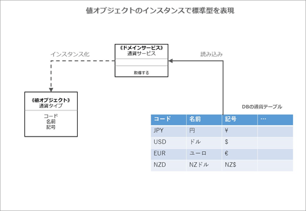

# 値オブジェクト

<!-- MarkdownTOC -->

- 値オブジェクトとは
- 値オブジェクトの特徴
    - （1）計測/定量化/説明
    - （2）不変性
    - （3）概念的な統一体
    - （4）交換可能性
    - （5）等価性
    - （6）副作用のない振る舞い
- 複数コンテキストの結合を緩やかにする値オブジェクト
- 区別や種類を示す標準型（タイプコード）
    - 列挙型\(enum\)で標準型を実装
    - 値オブジェクトで標準型を実装
- まとめ

<!-- /MarkdownTOC -->


## 値オブジェクトとは
DDDにおける「値オブジェクト」は**<font color="blue">何かを計測したり、定量化したりして説明する際に使用するオブジェクト</font>**です。

 - 数字/文字列/日付
 - 姓/名/金額/色

といった「ユビキタス言語」を表現するために活用します。

> 例えば、電話番号を数値型（Int型）ではなく`PhoneNumber`型を作ることで、ドメインの業務をプログラムでわかりやすく示すことができます。

 - 「エンティティ」とは対照的に「**<font color="blue">一意に識別して変更を管理する必要がないモノ</font>**」を値オブジェクトとします
 - 適切に設計していれば、値を想定外に書き換えられてしまうリスクが無いため安心して開発できます
 - 使いやすくテストしやすいメリットがある
 - 保守性や可読性に優れているため、DDDでは積極的に使用することが推奨されています

---
## 値オブジェクトの特徴

| 特徴 | 説明 |
|:-----|:-----|
| 計測/定量化/説明 | ドメイン内の何かを計測したり定量化したり説明したりする |
| 不変性 | 状態を不変に保つことができる |
| 概念的な統一体 | 関連する属性を不可欠な単位として組み合わせることで、概念的な統一体を形成する |
| 交換可能性 | 計測値や説明が変わったときには、全体を完全に置き換えられる |
| 等価性 | 値が等しいかどうかを、他と比較できる |
| 副作用のない振る舞い | 協力関係にあるその他の概念に「副作用のない振る舞い」を提供する |

### （1）計測/定量化/説明
値オブジェクトはドメインの何かを計測、定量化、説明した結果となります。

値オブジェクトが表現する概念

| 値オブジェクトの例 | 計測/定量化/説明 |
|:----------------|:----------------|
| 年齢 | 何年生きてきたのかを計測し、定量化した値 |
| 名前 | 何と呼ばれているかを説明した値 |

値オブジェクトでは、それらが扱っている名前が「適切に値を計測／定量化／説明しているか」意識することが重要といえます。

### （2）不変性
値オブジェクトはオブジェクトの生成時に値を設定することはできますが、**<font color="red">その後、値を変更することはできません</font>**。このことにより以下のメリットを受けることができます。

 - シンプルで安全 : 利用者の想定外の更新操作が原因で、矛盾した状態に陥ることがない。そのため利用者がオブジェクトの内部状態を気にせずに安心して使える
 - スレッドセーフ : マルチスレッドプログラミングにて、単一オブジェクトに対する複数スレッドにおける更新競合を制御する考慮が不要となる
 - キャッシュ : 値が変化しないことが保障されているため、安心してオブジェクトをキャッシュできる。

プログラムの実装としては、**<font color="blue">コンストラクタでのみ値を設定できるようにして、オブジェクト外部から操作できるセッターは用意しません</font>**。

### （3）概念的な統一体
値オブジェクトは複数の属性（プロパティ）を保持しており、それらが相互に関係して値を説明することができます.

> ex) 「通貨」という値オブジェクトの場合
>
> - 円やドルといった「単位」
> - その数量を表す「金額」
>
> 上記の属性を組み合わせることによって、適切な値を示すことができる。

一つの属性値だけでは意味を持たず、それぞれが組み合わさることで適切な説明をできることを「概念的な統一体」と呼びます。通貨の場合、「100」や「円」だけでは意味を持ちませんが、「100円」であれば、完結した意味を持つ値となります。

### （4）交換可能性
値オブジェクトは（2）不変性の特徴を持つため、途中で値の変更を行うことができません。__しかし、実際のプログラムでは値の変更を行いたいことがあると思います__。そのようなときは、**<font color="blue">変更後の値を設定した新しいオブジェクトを生成して交換します</font>**。このように交換できることを「交換可能性」と呼びます。

> 通貨の金額を変更したい場合、現在の値オブジェクトの値を元に新しい通貨オブジェクトを生成し交換します。
>
```java
CurrencyAmount currencyAmount = new CurrencyAmount(100, "円");

// 以下のように通貨の金額を変更することはできない！
// currencyAmount.changeAmount(200);

// 変更後の値を設定した新しいオブジェクトを生成して交換
currencyAmount = new CurrencyAmount(200, "円");
```

### （5）等価性
値オブジェクト同士のインスタンスを比較する場合、等しいかどうかを判断する「等価性」の判定方法を提供する必要があります。

 - エンティティ→「一意な識別子が同じか」で判定
 - 値オブジェクト→「**各属性が持つすべての値が同じか**」で判定

> 通貨の金額を変更したい場合
```java
CurrencyAmount a = new CurrencyAmount(100, "円");
CurrencyAmount b = new CurrencyAmount(90, "円");

a.equals(b);
```

### （6）副作用のない振る舞い

 - 副作用のない操作 : 「どのような状態で何回呼び出してもオブジェクトの状態が変わらない」操作
 - 「副作用がない関数」とわかっていれば、そのメソッドを呼び出すときに、他への影響がないため、安心して実装やテストを書けます。
 - アーキテクチャのCQRSパターンでは、「変更するコマンド」と「取得するクエリ」を明確に分離していたが、この「取得するクエリ」が副作用がない関数となる

　値オブジェクトは（2）の「不変」を満たすため、値を変更するメソッドは存在しません。そのため、副作用はなさそうに思えます。**しかし情報を取得するクエリでも、注意していないと副作用のある操作になる場合があります**。

> 例えば、三角形の面積を計算（縦と横を掛け2で割る）する関数で考えてみましょう。
>
```java
// 三角形の面積を計算する関数（副作用がある場合）
public int GetAreaSize(TriangleEntity entity) {
    entity.AreaSize = entity.Height * entity.Width / 2;
    return entity.AreaSize;
}
```
> ↑このメソッドでは引数にエンティティを渡しており、そのAreaSizeプロパティの値を更新しています
```java
// 三角形の面積を計算する関数（副作用がない場合）
public int GetAreaSize(int height, int width) {
    int result = height * width / 2;
    return result;
}
```
> ここでは、引数としてエンティティを渡すことをやめています。エンティティのAreaSizeプロパティの値を変えなければ副作用がないともいえますが、呼び出し側に不安を感じさせることや、将来的に不変でなくなるリスクが高いこともあるため、エンティティのプロパティの値を渡すように変更しています。これで副作用のないメソッドとなりました。

---
## 複数コンテキストの結合を緩やかにする値オブジェクト
引き続き、SaaSOvationを例に値オブジェクトの実装について見ていきましょう。複数のコンテキストを扱う場合、値オブジェクトを使うことでコンテキスト間の結合を緩くできます。


5章では、認証・アクセスコンテキストの「ユーザ」と「ロール」のエンティティについて検討しました。コラボレーションコンテキストでもユーザやロールと似た情報を取り扱いますが、コンテキスト間の結合を緩やかにするために「ユーザ」と「ロール」をそのまま使用せずに**<font color="blue">自分のコンテキスト(コラボレーションコンテキスト)で必要な情報を扱う「値オブジェクト」を用意しています</font>**。具体的には「モデレーター」「オーサー」「クリエーター」「オーナー」「参加者」を値オブジェクトとして作成しています。

このような他コンテキストの「エンティティ」「値オブジェクト」「標準型」といったオブジェクトを、自コンテキストではミニマムに保とうといった考え方は、コンテキスト間の結合を緩めるために有効といえます。

---
## 区別や種類を示す標準型（タイプコード）
タイプコードとはオブジェクトの種類を示すコードで、多くのアプリケーションで利用されている概念です。ヴァーノン氏は、このタイプコード（日本語だと「区分値」が近いかもしれません）にあたるものを「標準型」と呼んでいます。

> タイプコードの例) ある電話番号のタイプを「自宅」「携帯」「職場」に分類するシナリオがあるとします
>
> **タイプコード**での実装
```java
// 電場番号クラス（値オブジェクト）
public class PhoneNumber {
    // 電話番号種別（タイプコード）
    public static readonly int TYPE_HOME = 0;   // 自宅
    public static readonly int TYPE_MOBILE = 1; // 携帯
    public static readonly int TYPE_WORK = 0;   // 職場

    private int _Type;

    public PhoneNumber(int type) {
        _Type = type;
    }
}

// ↓利用イメージ
public class MainClass {
    public static void main(string[] args) {
        // 自宅の電話番号
        var phone = new PhoneNumber(PhoneNumber.TYPE_HOME);
    }
}
```
> **列挙型**での実装
```java
public enum PhoneNumberType {
    Home = 1,   // 自宅
    Mobile = 2, // 携帯
    Work = 3    // 職場
}

// 電話番号クラス
public class PhoneNumber {
    private PhoneNumberType _Type;

    // コンストラクタ
    public PhoneNumber(PhoneNumberType type) {
        _Type = type;
    }
}

// ↓利用イメージ
public class MainClass {
    public static void main(string[] args) {
        // 自宅の電話番号
        var phone = new PhoneNumber(PhoneNumberType.HOME);
    }
}
```

### 列挙型(enum)で標準型を実装
列挙型は少ないコードで区分値を取り扱える機能を備えています。Javaでは列挙型にメソッドを書くことができるため、コードに応じた描画文字への取得や、状態に応じた処理の振り分けも列挙型の1カ所で実装できます。このように列挙型を用いることで、境界づけられたコンテキストごとに異なる標準型機能をシンプルに管理できます。

> 通貨の金額(値オブジェクト)を生成する例
```java
public enum CurrencyType {
    Yen,     // 円
    Dollar,  // ドル
}
```
```java
CurrencyAmount currencyAmount = new CurrencyAmount(100, CurrencyType.Yen);
```

### 値オブジェクトで標準型を実装
別のパターンとして通貨のケースを考えてみましょう。

 - 通貨単位には円、米ドル、ユーロなどさまざまな通貨種別があることが想像できます
 - これらはマスタデータとして、システム全体で共有される不変の値となります

この場合、列挙型でコーディングする以外に、永続化層（DB）からデータを取得して値オブジェクトに展開する手法も存在します.



上図では標準型を列挙型ではなく、対応する値オブジェクトとしてコーディングし、それぞれの通貨型の概念を複数のインスタンスとして表現しています。

## まとめ
> ここまでを簡単にまとめると、コンテキストの中に存在するオブジェクトとしては、エンティティ、値オブジェクト、標準型（列挙型もしくは値オブジェクトで実装）といったパターンがあることを確認できました。標準型や値オブジェクトを活用し、コンテキスト同士の結合が最小になるミニマリズムな設計を意識するといいでしょう。
