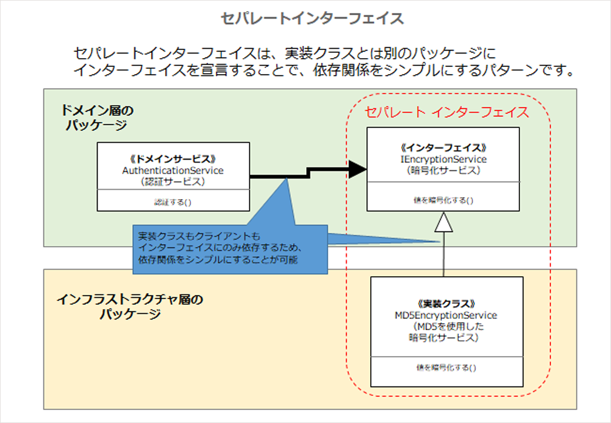

# サービス

<!-- MarkdownTOC -->

- DDDにおけるサービスとは
    - ドメインサービスの特徴
    - アプリケーションサービスの特徴
- ドメインサービスで実装する内容
- ドメインサービスの例
- ドメインサービスの失敗例
- ドメインサービス導入時のポイント
- ドメインサービスの設計方法
    - 1. セパレートインターフェイスが必要かどうか検討
    - 2. サービスの生成方法（セパレートインターフェイスの場合）

<!-- /MarkdownTOC -->


## DDDにおけるサービスとは
DDDでは、**エンティティ**、**値オブジェクト**、**集約**といった「ドメインオブジェクト」だけではなく、それらの外に記述したほうがよいロジックも存在します。そのようなときに、状態を持たないステートレスな「サービス」を使用できます。

サービスには、大きく分けて次の2つが存在します。

 1. **<font color="blue">ドメインサービス</font>** : エンティティや値オブジェクトの責務ではないドメインモデルのロジック(複数のドメインオブジェクトを使って計算する処理やファサード)
 2. **<font color="blue">アプリケーションサービス</font>** : 非常に薄く、ドメインモデル上のタスクの調整に使うロジック(腐敗防止層の変換・アダプター等)

### ドメインサービスの特徴
ドメインサービスの特徴は、ドメイン層の中に含まれ、ビジネスロジックを持つことができる点にあります。

### アプリケーションサービスの特徴
ドメインサービスに対して、アプリケーションサービスはドメイン層を使うアプリケーション層に含まれ、トランザクションやセキュリティのような調整的な処理を行います。

アプリケーションサービスを活用する例として、コンテキストの統合時に使われる「変換サービス」も存在します。他のコンテキストと連携し、腐敗防止層（3章）を実装する際に、専用のアダプターと変換サービスを用い、ドメインモデルの変換を行う場合があります。

---
## ドメインサービスで実装する内容
**ドメインサービス**の役割は、ドメインモデルが扱う「粒度の細かい処理」を担うものです。その処理がエンティティ／値オブジェクト／集約でもない場合に、ドメインサービスとして実装します。そのため、ドメインサービスはユビキタス言語として表現されます。

そのため、ドメインサービスで実装する内容としては

 - **<font color="blue">様々なエンティティ/値オブジェクト/集約を利用して計算するビジネスルール</font>**
 - クライアント側が複雑にならないように、ドメインオブジェクトの構成を変換したり、ビジネスロジックをまとめたりする

が挙げられます。

---
## ドメインサービスの例
> ここではSaaSOvationのドメインサービスのソースコード「businessPriorityTotalsクラス」を見てみましょう。

この処理では、Scrumプロダクトの中から未処理のバックログアイテムを取り出し、ビジネス優先度を合計する処理を実装しています。
```java
package com.saasovation.agilepm.domain.model.product.backlogitem;

// ビジネス優先度計算用ドメインサービス
public class BusinessPriorityCalculator {

    // リポジトリ
    private BacklogItemRepository backlogItemRepository;

    // コンストラクタ
    public BusinessPriorityCalculator(
            BacklogItemRepository aBacklogItemRepository) {

        super();

        this.backlogItemRepository = aBacklogItemRepository;
    }

    // 「ビジネス優先度を合計する」メソッド
    public BusinessPriorityTotals businessPriorityTotals(
            TenantId aTenantId,
            ProductId aProductId) {

        int totalBenefit = 0;
        int totalPenalty = 0;
        int totalCost = 0;
        int totalRisk = 0;

        // リポジトリからBacklogItemのコレクションを取得
        Collection<BacklogItem> outstandingBacklogItems =
                this.backlogItemRepository()
                    .allOutstandingProductBacklogItems(aTenantId, aProductId);

        // 複数のBaklogアイテムの集計処理を実施
        for (BacklogItem backlogItem : outstandingBacklogItems) {
            if (backlogItem.hasBusinessPriority()) {
                BusinessPriorityRatings ratings =
                        backlogItem.businessPriority().ratings();

                totalBenefit += ratings.benefit();
                totalPenalty += ratings.penalty();
                totalCost += ratings.cost();
                totalRisk += ratings.risk();
            }
        }

　      // 戻り値であるBusinessPriorityTotalsの値オブジェクトを設定
        BusinessPriorityTotals businessPriorityTotals =
                new BusinessPriorityTotals(
                        totalBenefit,
                        totalPenalty,
                        totalBenefit + totalPenalty,
                        totalCost,
                        totalRisk);

        return businessPriorityTotals;
    }

    private BacklogItemRepository backlogItemRepository() {
        return this.backlogItemRepository;
    }
}
```

---
## ドメインサービスの失敗例
ドメインサービスを導入するときの注意点について示します。

**ドメインサービスの多用/誤用** : ドメインサービスの危険な点は、ユビキタス言語ではないビジネスロジックを大量に記述できてしまう点です

 - 特にDDDに慣れていない場合、トランザクションスクリプトで処理を書いてしまう可能性があります
 - この問題は、使う必要がない箇所でドメインサービスを利用してしまうため、エンティティや値オブジェクトが空っぽの「ドメインモデル貧血症」を引き起こす危険性があります

**ドメインサービスのミニレイヤ** : ドメインサービスの「ミニレイヤ」を作ってしまう失敗があります

 - 検討することなく最初からドメインサービスのレイヤを作ってしまうと、このレイヤが肥大化する傾向にあります
 - それを避けるため、ドメインサービスのレイヤを作る必要がないコンテキストでは導入しないようにします

**アプリケーションサービス層での実装** : ドメインサービスをアプリケーションサービスで実装してしまう間違いもあります

 - アプリケーションサービスは、トランザクションやセキュリティといった、ドメインの外側の関心ごとの実装を行う場所です
 - アプリケーションサービスは利用者側であり、ドメイン内部の不要なロジックを知る必要はありません
 - このような観点でドメインサービスとアプリケーションサービスの区別を意識しておくといいでしょう

---
## ドメインサービス導入時のポイント

 - 値オブジェクト/エンティティ/集約の構成でドメインモデルを表現できていれば、**ドメインサービスがなくても問題ない**
 - エンティティと値オブジェクト単体では計算できない**ビジネスロジックがある場合**にドメインサービスの利用を検討します
 - ドメインモデルの詳細がクライアント側に漏れ出ないようにしつつ、複数のエンティティと値オブジェクトを組み合わせて抽出したり合計したりする**ビジネスルールを記述します**
 - 最初からドメインサービスを導入するのではなく、ドメインモデルの発展の過程でリファクタリングを行い、**必要になった時にドメインサービスが導入される**こともあります

**単一責任の原則(SRP : Single Responsibility Principle)** : 「*クラスを変更する理由は1つ以上存在してはならない*」<br>
1つのクラスが複数の役割を受け持っている場合、複数の役割がつながってしまい、片側の変更が逆側に影響を与えてしまいます。その結果、想定外の不具合が発生してしまいます（もし2つの役割が必ず同時に変更されるのであれば、分離する必要はありません）。

「クラスを単一の責務で設計する」という考え方はよく聞きますが、SRP原則では「仕様変更」に注目することで、より具体的にクラスを分割し、正しい名前をつけることを促しています。

参考資料：http://objectclub.jp/technicaldoc/object-orientation/principle/principle03

---
## ドメインサービスの設計方法
ドメインサービスの設計ポイントは

 1. セパレートインターフェイスが必要かどうか検討
 2. サービスの生成方法を検討

です。

### 1. セパレートインターフェイスが必要かどうか検討

**セパレートインターフェイスとは** → 実装クラスとは別のパッケージでインターフェイスを定義すること<br>



**セパレートインターフェイスを導入する理由** → 暗号化サービスに関して、現在はMD5方式による暗号化を行っていますが、今後、別の暗号化方式が採用される可能性があります.このようなときにセパレートインターフェイスを導入して実装クラスを分離するメリットがあります。

**実装クラスとセパレートインターフェイスの使い分け**<br>
なお、必ずしもセパレートインターフェイスが必要なわけではありません。暗号化サービスのクライアントである認証サービス「AuthenticationService」には、インターフェイスが存在していません。理由としては現時点で複数の実装が存在していないためで、**<font color="blue">今後実装クラスを差し替える可能性があればセパレートインターフェイスを使えばよいとしています</font>**。

### 2. サービスの生成方法（セパレートインターフェイスの場合）
セパレートインターフェイスの場合、インターフェイスと実装をひも付ける方法として、大きく分けて次の3つの方法が紹介されています。

 1. コンストラクタやメソッドのパラメータを使って、インスタンスを設定する
 2. オブジェクトを生成する(サービス)ファクトリを使う
 3. SpringやUnity ContainerなどのIoC/DIコンテナを用いて、サービスのインスタンスを注入する（依存性の注入）

IDDD本ではどれが正解とは明言せず、状況に応じた選択をするとよいとしています。ただし、DIコンテナの普及により、最近は3番目の依存性の注入が使われることが多いようです。

> 3. SpringやUnity ContainerなどのIoC/DIコンテナを用いて、サービスのインスタンスを注入する（依存性の注入）
```java
// Spring Bootの例
@RestController
@RequestMapping("api/customer")
public class CustomerRestController {
    @Autowired
    CustomerService customerService;

    // メソッド...
}
```