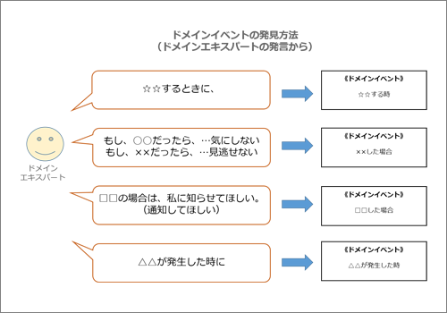
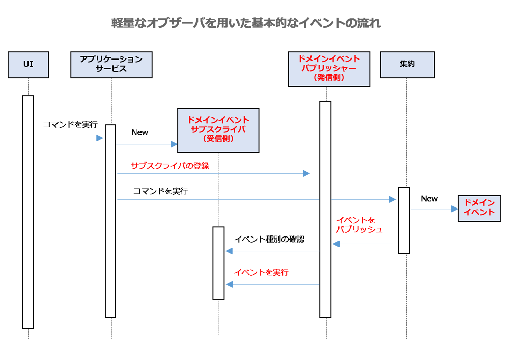
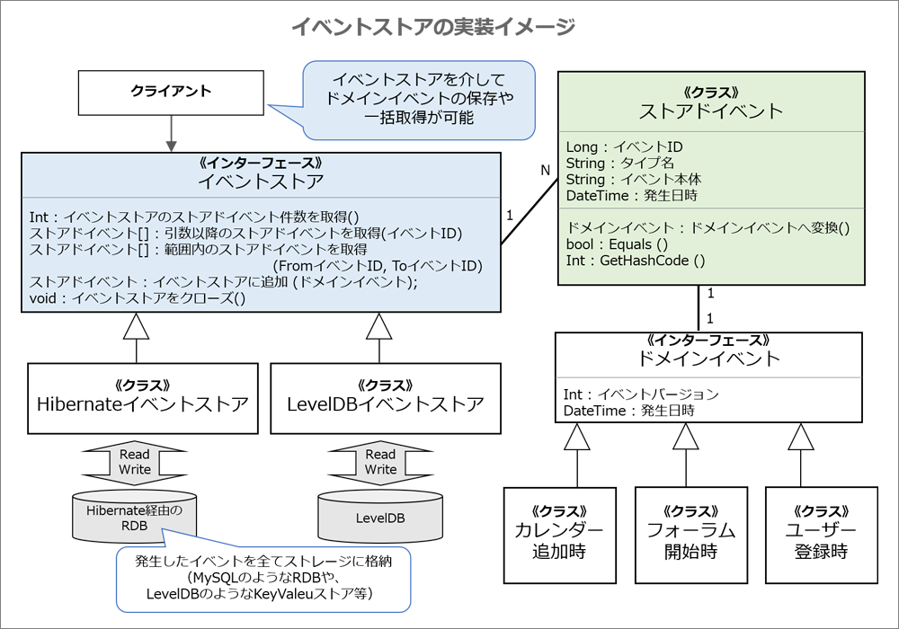

# ドメインイベント

<!-- MarkdownTOC -->

- ドメインイベントの概要
- ドメインイベントの設計
- 「ドメインイベント」クラスの実装
    - 不変なドメインイベントクラス
    - イベントの一意な識別子
- 基本的なイベント送受信方法
    - 軽量なオブザーバーを用いたイベントの送受信
    - イベントを発信するパブリッシャー
    - イベントを受信するサブスクライバ
- 他システム\(他の境界づけられたコンテキスト\)とのイベント送受信
    - 結果整合性と遅延の許容範囲
    - イベントストアとは
    - 【連携方法】自立型のサービス
    - 【連携方法】メッセージングミドルウェアによる連携
        - RabbitMQを用いたイベントの送受信
        - メッセージ基盤を使う時の注意点

<!-- /MarkdownTOC -->

---
## ドメインイベントの概要
ドメインイベントとは、ドメインで起こった出来事をモデリングする仕組み

 - ドメインイベントを使うことで、複雑になりがちな出来事を管理し、システム間の連携を柔軟にすることができます
 - 結果整合性（結果として一貫性が保たれること）を用いたシステムの構築が容易となる
 - ドメインイベントを利用することで、密結合になりがちな他システムとの連携や、他の集約へのデータ反映を疎結合にできる
 - ドメインイベントを導入することで、<strong style="color: blue;">発生したイベントは随時通知され、反映が必要なシステムを取り込むだけでよくなります</strong> → バッチプログラムが不要になる
 - 集約の制約からの開放 : DDDの集約には「単一のトランザクションでは単一の集約の固まりだけを変更しなければいけない」という推奨ルールが存在しています。しかしモデリングをしていると、別の集約も更新したい出来事が発生することがあります。こうした場合にイベントを活用することで、トランザクションの範囲を広げることなく結果整合性を保てます。


---
## ドメインイベントの設計
「エンティティ」や「値オブジェクト」ではオブジェクトの属性や振る舞いに対してモデリングを行ってきました。これに対して、ドメインイベントは「**ドメインエキスパートが注目する出来事**」にフォーカスします。具体的にはドメインエキスパートが話す「**<font color="blue">〜する時に</font>**」や「**<font color="blue">〜した場合</font>**」といったフレーズに注目します。



また、イベントは「システム的な観点」から導入するケースもあります。
> 例えば、特定のシステムで発生した出来事を外部システムに通知する場合や、境界づけられた同じコンテキスト内のトランザクションを分離する場合などです。

<strong>設計プロセス</strong>

 1. ドメインエキスパートの「その結果どうなるのか」「いつ無視するべきか」といった業務的な観点からイベントの要否を判断
 2. 「他システム連携は必要か」「イベントソーシングは必要か」などの技術的な観点からイベントの連携方式を検討


**イベントを用いた処理の例**<br>
> SaaSOvasionのアジャイルプロジェクト管理コンテキストの場合「バックログアイテムがコミットされたら、コミット先のスプリントやその他の関係者たちに通知する」といった要件があります。この例をイベントを用いて制御する場合、次の流れとなります。
>
> 1. 集約のコマンド「スプリントにバックログアイテムをコミットする」が呼び出される。
> 2. 集約のコマンドで、コミットされた旨の「ドメインイベント」が生成される。
> 3. 「ドメインイベントパブリッシャー」がイベントを発行（出版）する。
> 4. 「サブスクライバ」がイベントを受信（購読）する。
> 5. 「サブスクライバ」でメールを送信する。
>
> 
>
> IDDDではイベントの発行を「パブリッシャー」で行い、イベントの受信を「サブスクライバ」で行います。


サブスクライバが処理する内容としては、大きく次の3つの傾向があります。

 1. 同期処理 : イベントに応じた処理を、イベント発行と同じトランザクションで実施します。サブスクライバで処理が完結します
 2. イベント格納処理 : 同一トランザクションではイベントの記録だけ行います。後述する「イベントストア」等を活用して、イベントに応じた処理は別途実行されます
 3. 分散処理 : イベントを他システムにリアルタイムで転送し、2フェーズコミットなどの「分散トランザクション」で制御を行います。この分散トランザクションの導入は製品固有の知識が必要なため、難易度が高くなる傾向にあります


---
## 「ドメインイベント」クラスの実装

<div style="text-align: center;">
    <strong><<ドメインイベント>></strong><br>
    <u><strong>イベント名</strong></u>
    <li>「一意な識別子」プロパティ</li>
    <li>「発生タイミング」プロパティ</li>
    <li>「発生バージョン」プロパティ</li>
    <li>「イベントごとの独自」プロパティ</li>
</div>

イベント名

 - イベントのモデリングを行う場合、イベント名やプロパティは「イベント発生元のコンテキスト」のユビキタス言語に従って検討します
 - 集約のコマンドから発信されるイベントの場合、実行メソッドに準じたイベント名を使います
    - ex) バックログアイテムの集約でスプリントにコミットした時のイベントであれば「BacklogItemComitted（バックログアイテムコミット時）」という名前を使用します

### 不変なドメインイベントクラス
通常、ドメインイベントクラスは不変クラスとして設計されるため、コンストラクタではその値を設定することのみ可能で、プロパティは読み取り専用となります。

### イベントの一意な識別子
ドメインイベントクラスには「一意な識別子」は存在していませんが、イベントを使って外部のコンテキストと連携したり、メッセージ基盤を使ったりする場合には、一意な識別子が必要となる場合があります（一般的に、イベントの受信側は複数回イベントが送信されてくることを考慮し、「一意な識別子」を用いて重複排除を行います）。


---
## 基本的なイベント送受信方法
イベントの連携はパブリッシャー（出版側）と、サブスクライバ（購読側）による組み合わせで構成されます。

### 軽量なオブザーバーを用いたイベントの送受信
シンプルにイベントを送受信するには「軽量なオブザーバー」が良いと思います。

 - オブザーバー : 状態の変化を他のオブジェクトに通知するデザインパターンのひとつ



軽量なオブザーバーを用いて、イベントを処理する流れは次の通りです。

 1. **[UIやWebサービス]** : アプリケーションサービスのコマンドを呼び出す。
 2. **［アプリケーションサービス］** : イベント受信時に実行するサブスクライバをパブリッシャーに登録する。
 3. **［アプリケーションサービス］** : 集約のコマンドを呼び出す。
 4. **［集約］** : ドメインイベントを生成する。
 5. **［集約］** : パブリッシャーを用いて、イベントを発信する。
 6. **［パブリッシャー］** : サブスクライバに対応するイベントの種類を確認して、イベントを配信（実行）する。
 7. **［サブスクライバ］** : 自分が対応するイベントが配信されてきた場合は、イベントに適した処理を実行する。

軽量なオブザーバーの特徴は、パブリッシャーとサブスクライバは同じプロセス／スレッドで動作し、イベントを発行した同じトランザクションにて処理される点です。

### イベントを発信するパブリッシャー
パブリッシャーは、サブスクライバにイベント通知を送る機能を提供します。

サンプルコード：https://github.com/VaughnVernon/IDDD_Samples/blob/master/iddd_common/src/main/java/com/saasovation/common/domain/model/DomainEventPublisher.java


### イベントを受信するサブスクライバ
サブスクライバは、イベント受信時に行う機能を提供します。

例えば、メールを送ったり、イベントストア（後述）に情報を保存したりします。

IDDDのサンプルでは、`DomainEventSubscriber`というシステム共通のインターフェイスを用いて、処理別にインターフェイスを実装します。
```java
package com.saasovation.common.domain.model;

public interface DomainEventSubscriber<T> {

    public void handleEvent(final T aDomainEvent);

    public Class<T> subscribedToEventType();
}
```

---
## 他システム(他の境界づけられたコンテキスト)とのイベント送受信
リモートの境界づけられたコンテキストと連携するためには、ドメインモデルと外部システムにイベントを連携するメッセージ基盤との間で整合性を保つ必要があります。整合性の保ち方として主に3つの方法を紹介しています。

| 概要 | 説明 | メリット | デメリット |
|:----|:-----|:--------|:---------|
| 共有データ領域 | ドメインモデルとメッセージ基盤で同じデータ領域を使う | ドメインモデルの変更とメッセージ基盤が同じトランザクションのため性能が良い | メッセージ基盤のストレージをドメインと同じところに置くことが難しい |
| 分散トランザクション | ドメインモデルとメッセージ基盤が別のデータ領域を使うが整合性を保つために2フェーズコミットを使う | ドメインモデルとメッセージ基盤でデータ領域を分離できる | 分散トランザクションの仕組みが複雑、未対応のプロダクトも多い |
| イベントストア | ドメインモデルとイベント用のストレージを同じデータ領域に用意する | ドメインモデルが直接メッセージ基盤を使わないためシンプル | イベントストアのイベントをメッセージ基盤に転送する仕組みが必要 |

### 結果整合性と遅延の許容範囲
なお、複数の境界づけられたコンテキストに連携する時には結果整合性が重要となります。非同期による遅延の許容範囲がどの程度であるかは、ドメインエキスパートに聞いて確認します。リアルタイム性が求められた場合は、現システムが導入される前は、どの程度の遅延が許容されていたのか確認してみるといいでしょう。


### イベントストアとは
イベントストアとは、発生したイベントの履歴をストレージに記録する方法

 - 格納したイベント情報を利用者に公開することで活用します
 - 利用側は必要に応じてイベント発生元のドメインモデルを取得して、自分の境界づけられたコンテキストに取り込みます

イベントストアには、次のようなメリットが備わっています。

 - メッセージ基盤を通してドメインイベントを発行するキューとして使用できる
 - モデルで発生したイベントを全て履歴として記録できる（調査や監査に利用）
 - イベントストアのデータを使って、分析や予測ができる（後から集計が可能）
 - イベントを用いてリポジトリの構築を行い、集約の再構築ができる（イベントソーシングにてデータパッチやデバッグも可能）

**イベントストアの実装イメージ**<br>
イベントストアの実装例としては、「イベントストア（EventStore）」インタフェースを利用してイベントの履歴情報をストレージへ格納します。

 - イベントストアのストレージはMySQLのようなRDBや、LevelDBのようなNoSQLなどから最適な製品を選択します
 - どのストレージを選択するにしても、ドメインモデルの情報とイベント履歴の整合性が保たれるように注意します



ストレージには「ストアドイベント（StoredEvent）」クラスをシリアライズした内容が格納されます。これらは「ドメインイベント（DomainEvent）」インターフェースを実装するイベントクラスから変換することができます。

### 【連携方法】自立型のサービス
他の境界づけられたコンテキストと連携する場合、ドメインイベントを用いると「自立型のサービス」になることがメリットとして挙げられます.

 - 自立型のサービス : 他のサービスに依存せずに動作するシステムのこと
 - 他のシステム（API／RPC）をリアルタイムに呼び出している場合、それらがダウンしていると、自身のサービスもダウンしたりパフォーマンスが低下したりする問題があります

そこで、自システムから外部システムを呼び出すのではなく、**<font color="blue">外部システムから自システム（イベント通知用REST API）を定期的にポーリングをしてもらうことでシステムの独立性を保つようにします</font>**。このような連携方式では、イベントを利用する外部システムが増えたとしても、イベント発行側にて変更しなくて良いメリットがあります。

**RESTによる通知API**<br>
イベント通知用のREST設計では、最新ログ（カレントログ）と過去ログ（アーカイブログ）の取得ができるように設計します。

 - イベント数は膨大になるため、全レコードを取るのではなく、クライアント側で範囲を指定できるようにするのが一般的
 - サーバーの負荷が高くならないようにキャッシュを使うようにします

### 【連携方法】メッセージングミドルウェアによる連携
上記ではRESTを用いたイベント通知について紹介しましたが、REST APIの実装をする代わりにメッセージングミドルウェアを使うことも可能です。

メッセージングを行うミドルウェアにはActiveMQやRabbitMQ、Akka、NServiceBusといったソフトウェアが存在していますが、IDDDではRabbitMQを用いた例を紹介しています。

#### RabbitMQを用いたイベントの送受信
RabbitMQを用いてイベントを送信する例は以下の通りです。

 1. イベントストアからイベントを一意な識別子でソートして取得する。
 2. 取得したリストを昇順にたどり、それぞれをエクスチェンジに送信する。
 3. メッセージの発行に成功したら、そのイベントがエクスチェンジに発行されたことを記録する

RabbitMQでは、エクスチェンジ（メッセージを送付する機能）にデータを連携するだけでデータを配信できます。配送方式や配送先の選択はRabbitMQ側で制御できます。

#### メッセージ基盤を使う時の注意点
メッセージ基盤を使う時の注意点として、メッセージが重複処理される可能性を考慮しておく必要があります。

 - メッセージが重複処理される可能性がある : 送信側でメッセージを送信した後で、ドメインモデル側のDBのコミットに失敗してしまうケース等の発生
 - 配送順番が保証されないことも考慮する必要がある

このような問題に対して、購読側にて複数回取り込んでも問題ないように実装します。通常、メッセージID（イベントID）を使用して、どこまでメッセージを処理したかを記録しておきます。

