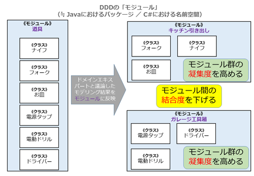

# モジュール

<!-- MarkdownTOC -->

- モジュールとは
- DDDでのモジュール
    - 高いほど好ましい「凝集度」
    - 低いほど好ましい「結合度」
- モジュールの設計方法
- モジュールの命名規則
    - トップレベルのモジュール名
    - トップレベル下のコンテキスト名
    - ドメイン層
    - アプリケーション層
    - インフラ層
    - プレゼンテーション層\(MVCのコントローラ\)
    - リソース層\(MVCのコントローラー?\)
- まとめ
- 境界づけられたコンテキストとモジュールの使い分け

<!-- /MarkdownTOC -->


## モジュールとは
オブジェクトをまとめて管理する仕組みのこと

 - Java→パッケージ
 - Python→パッケージ,モジュール

## DDDでのモジュール
DDDではソースファイルを物理的に分けてクラス群の責任と役割を明確にして、保守性や可読性を上げるだけではなく、**<strong style="color:blue;">高凝縮で低結合なモジュール化されたモデルを、ユビキタス言語に従って構築すること</strong>**を推奨しています。

> 
> 
> 上図では「道具」という１つのモジュールを以下の２つのモジュールに分割しています。
> 
>  - 「キッチン引き出し」 : ナイフ、フォーク、お皿はキッチンで一緒に使う（依存関係があり凝集性が高い）ため同じモジュールにしています
>  - 「ガレージ工具箱」 : 「キッチン引き出し」とは一緒に使わない（結合度が低い）ガレージ工具類を別のモジュールとして設計しています

このように、モジュール設計では凝集度と結合度の両方を意識します。

### 高いほど好ましい「凝集度」

 - 「凝集度」 : モジュールのまとまり具合に関する指標
 - 特定の機能に対する責任を持って、正しくまとまって協調しているかを示す指標で、高いほうが良いとされます


### 低いほど好ましい「結合度」

 - 「結合度」 : モジュールを変更しやすいように適切に分割できているかどうかを示す指標
 - 密結合（結合度が高）なシステムでは修正が困難になるため、疎結合（結合度が低）なシステムが良いとされます

---
## モジュールの設計方法
モジュール設計における重要なポイントとして、まず「モジュールの存在を軽視しない」ことを挙げています。エンティティ／値オブジェクト／サービス／イベントと同じ扱いで、モジュールについても十分に議論するようにします。

モデリングする際には、正確な意図が伝わるようにモジュール名を検討します.必要があれば恐れずにモジュール名の変更を行います。ドメインエキスパートとディスカッションしている最新情報がモジュールに反映されるように努めます。

| モジュールの設計指針 |
|:-------------------|
| モジュールをDDDにおいて非常に重要な概念と認識し、モデリングの概念にフィットさせ設計する。例えば、<strong style="color:blue;">集約に対して1つのモジュールを用意する</strong>。 |
| モデリングの概念に従い、<strong style="color:blue;">モジュール名をユビキタス言語に</strong>従う。 |
| モジュール名を機械的に決めない。例えば、クラスの型や役割だけでまとめるようなモジュールを作らない。 |
| 疎結合に設計する。<strong style="color:blue;">極力、他のモジュールに依存しないようにする</strong>。 |
| モジュール同士の結合が必要な場合に、<strong style="color:blue;">循環依存が起きないようにする</strong>。意味的に双方向な依存関係があっても実装上は単一方向の依存関係が望ましい。 |
| モジュール間の循環依存は避けるべきだが、<strong style="color:blue;">親子関係（上位と下位関係）のモジュールに限り、やむをえない</strong>場合がある。 |
| 取りまとめているオブジェクト群に合わせた名前をつけ、<strong style="color:blue;">そぐわない場合はリファクタリング</strong>する。 |

---
## モジュールの命名規則

 - JavaやC#の命名方針に従い、ピリオドにて区切られた階層構造にて記述
 - 階層構造の先頭には、組織名を使うことが一般的

### トップレベルのモジュール名
トップレベル名として組織名を設定しています。Javaの場合、インターネットドメイン名（comやjp）が一般的なため、ここではcomという名前で始めています。このような命名規約を使うことで、JARやDLLにおいて他プロジェクトとの衝突を避けることができます。
```java
// Javaの場合
com.saasovation

jp.co.yahoo.ad
```

### トップレベル下のコンテキスト名
トップレベルの組織名を決めた後は、その下の名前を検討します。

 - **<font color="bllue">「境界づけられたコンテキスト」に従った名前を追加</font>**

```java
com.saasovation.identityaccess  // 汎用サブドメイン：認証コンテキスト
com.saasovation.collaboration   // コアドメイン : コラボレーション管理コンテキスト
com.saasovation.agilepm         // 支援サブドメイン : アジャイル管理コンテキスト

jp.co.yahoo.crm.campaignmatch
```
このように名前をつけることでユビキタス言語をそのまま反映したわかりやすいものとなります。

### ドメイン層
**「Domain」モジュール**<br>
ドメインに関する情報を格納
```java
com.saasovation.identityaccess.domain
com.saasovation.collaboration.domain
com.saasovation.agilepm.domain
```
この配下にはドメインに関する情報を格納します（このDomainフォルダの直下にはクラスは存在せず、その下位のサブフォルダの中に格納します）。

**「Domain.Model」モジュール**<br>
「Domain」内に「Model」モジュールを追加。
この「Model」配下のサブモジュールには、値オブジェクト、エンティティ、イベントといったクラスやインタフェースが定義されます。
```java
com.saasovation.identityaccess.domain.model
com.saasovation.collaboration.domain.model
com.saasovation.agilepm.domain.model
```
> `domain.model`配下にサブモジュールがあり、その機能に必要な
>
> - エンティティ
> - 値オブジェクト
> - ドメインサービス
> - ドメインイベント
> - 集約
> - リポジトリのインターフェイス
>
> が格納される。

担当する機能のコンセプトを示すモジュール名を付与する
```java
com.saasovation.collaboration.domain.<コンセプト名>
```
ドメインのコンセプトを示す名前（Products、Tenants、Teams等）をつけます。このモジュール名はチームで検討し、チームの会話で利用します。

### アプリケーション層
これまで、ドメインモデルのモジュールを見てきましたが、それ以外の要素についても確認してみましょう。DDDでは、ドメインオブジェクトを利用するアプリケーションレイヤ側にも処理を持ちます。ここのモジュール設計も同様で、わかりやすく管理できるように分割します。

**「application」モジュール**<br>
ドメインに関する情報を格納
```java
// 例
com.saasovation.identityaccess.application.<アプリケーションサービス,コマンド>
com.saasovation.identityaccess.application.<コンセプト名>.<アプリケーションサービス,コマンド>
com.saasovation.collaboration.application.<アプリケーションサービス,コマンド>
com.saasovation.agilepm.application.<コンセプト名>.<アプリケーションサービス,コマンド>

com.saasovation.identityaccess.application.command
com.saasovation.identityaccess.application.NotificationApplicationService.java
com.saasovation.collaboration.application.calendar
com.saasovation.collaboration.application.forum
com.saasovation.agilepm.application.products
com.saasovation.agilepm.application.sprint
```

### インフラ層
```java
com.saasovation.identityaccess.infrastructure.persistence.HibernateGroupRepository.java

com.<サイト名>.<コンテキスト>.infrastructure.<コンセプト名>.<リポジトリの実装クラス,DAO>
```

### プレゼンテーション層(MVCのコントローラ)
```java
jp.co.<サイト名>.<コンテキスト>.presentation.controller.<コントローラー.java>
jp.co.<サイト名>.<コンテキスト>.presentation.<コンセプト名>.<コントローラー.java>
```

### リソース層(MVCのコントローラー?)
```java
com.saasovation.identityaccess.resource.UserResource.java
com.example.identityaccess.resource.v1.UserResource.java

com.<サイト名>.<コンテキスト>.resource.<コントローラー.java>
jp.co.<サイト名>.<コンテキスト>.resource.<コンセプト名>.<コントローラー.java>
```

## まとめ
```java
// ドメインレイヤ
com.<サイト名>.<コンテキスト名>.domain.model.<エンティティ,値オブジェクト,ドメインサービス,ドメインイベント,集約,リポジトリのインタフェイス>
com.<サイト名>.<コンテキスト名>.domain.model.<コンセプト名>.<エンティティ,値オブジェクト,ドメインサービス,ドメインイベント,集約,リポジトリのインタフェイス>
com.<サイト名>.<コンテキスト名>.domain.model.<コンセプト名>.<サブコンセプト名>.<エンティティ,値オブジェクト,ドメインサービス,ドメインイベント,集約,リポジトリのインタフェイス>

// アプリケーションレイヤ
com.<サイト名>.<コンテキスト名>.application.<アプリケーションサービス,コマンド>
com.<サイト名>.<コンテキスト名>.application.<コンセプト名>.<アプリケーションサービス,コマンド>

// インフラレイヤ
com.<サイト名>.<コンテキスト>.infrastructure.<コンセプト名>.<リポジトリの実装クラス,DAO>

// リソースレイヤ
com.<サイト名>.<コンテキスト>.resource.<コントローラー.java>
com.<サイト名>.<コンテキスト>.resource.<コンセプト名>.<コントローラー.java>
```

尚、サブコンセプト配下にサブコンセプトを作成することも可能です。(それがユビキタス言語に従っていれば)
参考：https://github.com/VaughnVernon/IDDD_Samples/tree/master/iddd_agilepm/src/main/java/com/saasovation/agilepm/domain/model

---
## 境界づけられたコンテキストとモジュールの使い分け
なお、モジュールによる分割か、境界づけられたコンテキストによる分割かで悩むことがあるかもしれません。

 - モジュール→関してはこれまで述べてきた通りクラス群でまとめる仕組み
 - 境界づけられたコンテキスト→ユビキタス言語の境界線（ビジネス的な境界線）

モデルが大きくなってきた場合、ドメインエキスパートの言葉に従い、どのような方法による分割が最適かを検討していくと良いでしょう。そのため最初の設計時は、無理して分割してしまうのではなく、ひとまとめのままのほうが無難かもしれません。
