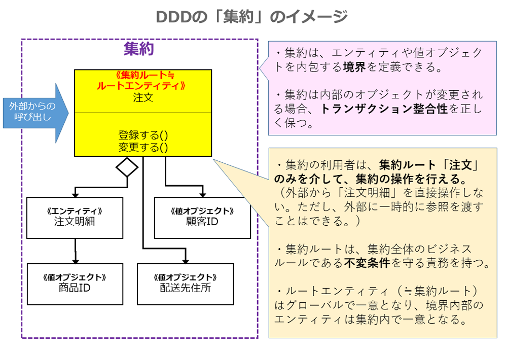
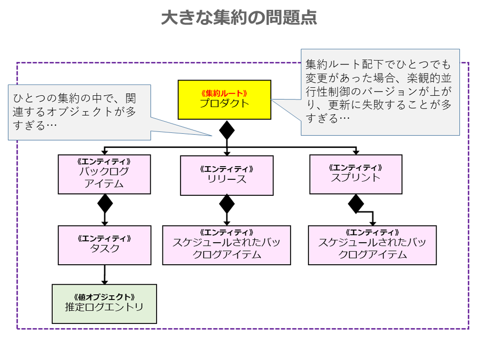
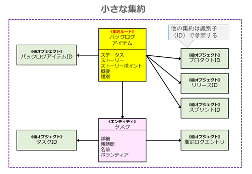

# 集約

<!-- MarkdownTOC -->

- 集約とは
    - DDDにおける集約
- 集約のモデリング
- 集約の設計におけるルール
- 基本ルールに反する例外パターン
- 集約の実装コード例
    - 1. ルートエンティティの選択
    - 2. 集約の部品を極力、値オブジェクトにする
- 集約のコーディング時に役立つ法則
    - デメテルの法則
    - 「命じろ、たずねるな（Tell-Don't-Ask）」の指針
    - 集約での依存性の注入を避ける

<!-- /MarkdownTOC -->

## 集約とは
参考ページ：https://nrslib.com/bottomup-ddd-2/#outline__5
### DDDにおける集約
DDDにおける集約（Aggregates）とは、

 - **<font color="blue">オブジェクトのまとまりを表し、整合性を保ちながらデータを更新する単位</font>**
 - オブジェクト群の生成/読み込み/変更/保存といったライフサイクル管理が行われる

**外部から集約を操作できる「<font color="blue">集約ルート</font>」**<br>
外部から集約を操作する場合、代表オブジェクトである「集約ルート（≒ルートエンティティ）」のみ参照することができます。集約ルートを操作することで集約全体の整合性を保ちながらデータを変更できます。



> 上図の例では、注文に関わるオブジェクト群が集約の「境界線」となっています。操作をしたい場合「注文」という「集約ルート」に変更依頼をすることができます。集約内部にある「注文明細」や「配送先住所」といった集約ルート以外のオブジェクトに直接指示を出すことはありません。

**集約が担う境界内の「<font color="blue">整合性</font>」**<br>
集約はオブジェクト群の整合性の境界を保ちながらデータを更新します。整合性には以下の2つが存在しています。

 - トランザクション整合性
 - 結果整合性（4章「CQRSと結果整合性」参照）

DDDの集約は、即時的な整合性である「トランザクション整合性」と同義です。このことから、トランザクションの分析をした後でなければ、集約の設計が適切かを判断できません。

なお、トランザクションという言葉は使っていますが、特定のDBのトランザクション命令そのものではありません。あくまで（結果整合性とは対照的に）同期的に整合性を保つ必要性を表しています。

> 上の注文例の場合、注文明細として100円の追加をした場合には、注文合計額にも100円が同時に加算された上で確定される必要があります。

## 集約のモデリング

**巨大な集約の問題点**<br>
まず、何も考慮せずにモデリングした場合、大きな集約ができ上がります。



> 上記のモデリングは簡単ですが、この場合、実用に耐えません。複数のユーザーが同時に操作した場合に、トランザクションが衝突する可能性が非常に高いためです。

 - 大きい集約を作成した場合、様々なオブジェクトを毎回メモリに読み込み、更新する必要があり、性能面で期待することはできない
 - 通常、エンティティの実装を行う場合、楽観的並行性制御と呼ばれる手法がよく用いられます
    - この手法では、エンティティがバージョン番号を保持しており、なんらかの変更を行う度にバージョン番号を加算していきます
    - もし別のユーザーが集約を更新済みの場合、想定しているバージョン番号と異なるため、後から更新しようとしたユーザーがエラーとなります
    - そのため別のユーザーに更新された後の最新値を取得して、更新処理をやり直す必要があります。

そこで、大きな集約の問題を回避するために、小さい集約を複数作成することにします。

**小さな集約の特徴**<br>
これまでひとつだった集約を複数に分解します。各集約それぞれに集約ルートが存在することになります。



> この例では、大きな集約を分割し、バックログアイテムの集約にフォーカスしています。プロダクト／リリース／スプリントといったエンティティは、別の集約のルートエンティティとしてモデリングしています。そして、他の集約ルートを直接参照するのではなく、識別子（ID）のみを参照しています。トランザクションは、集約を取り扱うアプリケーションサービス（11章）側で制御することになります。

大きな集約と小さな集約の違いについて簡単に見てみましょう。

大きい集約と小さい集約の違い

| 項目 | 大きい集約 | 小さい集約 |
|:-----|:---------|:----------|
| トランザクションの衝突 | 多い | 少ない |
| 設計難易度 | 低 | 中 |
| スケーラビリティ・性能 | 低 | 高 |
| エンティティ間の依存 | 直接参照 | ID参照 |

---
## 集約の設計におけるルール

 1. 小さな集約を設計する : パフォーマンスやスケーラビリティといった非機能要件の観点から、小さな集約になるように設計を行います
 2. 極力、値オブジェクトから構成する : 集約の内部は、ルートエンティティ以外は「値オブジェクト」だけであることが望ましいとされています
    - どうしても、ユースケース的に大きな集約を作らなければいけない場合は、結果整合性にて遅延を許容できないか検討してみるといいでしょう
 3. 真の不変条件(ビジネスルール)を、整合性の中にモデリングする
    - 不変条件とは、どのような操作を行おうとも維持される「ビジネスルール」
    - ex) 「小計と消費税を足した値が合計となる」や「配送先住所が国外の場合は、電話番号に国コードを必須とする」
    - そのため、集約を設計する前に、まず境界づけられたコンテキスト内における不変条件を理解する必要があります。それを理解することで、集約にどのオブジェクトを含めることができるかを検討できます
    - 集約ルートは、集約内のエンティティと値オブジェクトの値が正しいことを制御する責任を持ちます。
 4. 他の集約への参照へは、その一意な識別子を使用する : 集約では、他の集約ルートへの参照を保持するようにします
    - 密結合ではなく識別子（ID）を介した参照を使うことで、疎結合に集約を組み合わせることができます。一般的に複雑になるため双方向の参照も行いません。
    - 重要な注意点として、単一のトランザクションでは単一の集約のみ更新します。複数の集約を更新しないようにします
    - どうしても複数の集約を更新しなければいけない場合は、結果整合性を用いた対策を検討する必要があります。
 5. 境界の外部では結果整合性を用いる : 複数の集約にまたがるビジネスルールがある場合には、結果整合性を使うことになります
    - この場合、メインとなる集約でイベントを発生させ、受信した側の集約にて処理を継続します→この流れによって結果整合性が実現します

トランザクション整合性か結果整合性のどちらかの判断で悩む場合には、ユースケースを実行するユーザーが自分であれば「トランザクション整合性」を利用し、他のユーザーやシステムの役割と思える場合には「結果整合性」を使うことがヴァーノン氏によるひとつの指針となっています

---
## 基本ルールに反する例外パターン
これまで、集約の設計に関する基本ルールを紹介してきましたが、あえて、トランザクションをひとつにまとめる場合もあります。それらについて見ていきましょう。

**【例外1】ユーザーインターフェースの利便性を優先**<br>
画面の操作上、複数の集約をまとめて作成するようなシナリオの場合、集約を一括で作って操作しても問題ありません。

**【例外2】技術的な仕組みの不足**<br>
結果整合性を実現するためのアーキテクチャが存在しない場合（イベントを扱うメッセージング基盤がない場合）には、集約を小さくすることが難しくなります。

**【例外3】グローバルトランザクションの強制**<br>
既存のアーキテクチャ基盤や企業ポリシーにより、2フェーズコミットのようなグローバルトランザクションを使わなければいけない場合があります。極力複数の集約を更新しなくても問題ないように、トランザクションの衝突が発生しないようにします。

**【例外4】クエリのパフォーマンス改善**<br>
他の集約を参照する場合、識別子で参照せずに直接参照したほうが性能が良いケースが考えられます。このような場合は直接参照します。

---
## 集約の実装コード例

### 1. ルートエンティティの選択
集約を作る場合、外部からの操作を担うひとつのエンティティを集約ルートとして選択します。
```java
// 集約ルート（ルートエンティティ）「バックログアイテム」
public class BacklogItem extends Entity {
    //コンストラクタ
    public BacklogItem(...) {
        // (省略)
    }

    // 自分の一意な識別子(値オブジェクト)
    public BacklogItemId backlogItemId() {
        return this.backlogItemId;
    }

    // 他集約「テナント」の一意な識別子（値オブジェクト）
    public TenantId tenantId() {
        return this.tenantId;
    }

    // 他集約「プロダクト」一意な識別子（値オブジェクト）
    public ProductId productId() {
        return this.productId;
    }

    // 「タスク」群の参照（エンティティ）
    public Set<Task> allTasks() {
        return Collections.unmodifiableSet(this.tasks());
    }

    // 自分のプロパティ「バックログアイテムタイプ」（値オブジェクト）
    public BacklogItemType type() {
        return this.type;
    }

    //...
}
```

 - 集約ルートは**エンティティ**なので、そのエンティティを判別するための一意な識別子を検討します

### 2. 集約の部品を極力、値オブジェクトにする

 - 設計ルールで紹介したように、集約の属性としては値オブジェクトを使うことが推奨されています。
 - エンティティにするか値オブジェクトにするかを悩んだ場合、後々の交換が大変でなければ「値オブジェクト」を選択します。
 - なお、集約に入れたオブジェクトは他の集約で使ってはいけないと悩んだ方もいるかもしれませんが、そのような制約はありません。集約の内部に実装するエンティティも値オブジェクトも、他の集約から参照して問題ありません。

---
## 集約のコーディング時に役立つ法則
### デメテルの法則
デメテルの法則は、最小知識の原則とも呼ばれ、オブジェクトのメンバーの「プロパティやメソッド」を直接触らない法則です。例えば、あるオブジェクトが存在する場合、呼び出していいのは以下の4つとなります。

 1. オブジェクト自身のメソッド
 2. 自身にパラメータとして渡されたオブジェクトXのメソッド
 3. 自身の内部でインスタンス化されたオブジェクトYのメソッド
 4. 自身が保持しており、直接アクセスできるオブジェクトZのメソッド

逆に呼び出してはいけないものは、オブジェクトX／Y／Zのメソッドが戻したオブジェクトのメソッドです。

この法則に従う場合、オブジェクトが他の構造に依存しにくいため、保守性が向上するといわれています。デメテルの法則は、集約ルートに対して命令を出すが、集約の内部のエンティティや値オブジェクトに対して命令を出さないことを表しています。

### 「命じろ、たずねるな（Tell-Don't-Ask）」の指針
「命じろ、たずねるな」の指針は、オブジェクトを操作する際に、そのオブジェクトの内部状態をたずねることなく、命令だけするという指針です。呼び出し先のオブジェクトの状態をたずねるという行動は、呼び出し側が知る必要のない情報を考慮する必要があることになるため、あまり望ましくありません。

### 集約での依存性の注入を避ける
別の集約を識別子で参照する場合、参照先の集約はそのままでは読み込まれません。参照先の集約の情報を永続化層から読み出す場合、次の2つの方式が存在します。

**【方式1】集約の中からリポジトリを呼び出す方式**<br>
「切り離されたドメインモデル」という遅延読み込み方法です。IDDD本では集約の内部からリポジトリやドメインサービスを使用することになり、ドメイン層の中で永続層を意識する必要があるためあまり推奨されていません。

**【方式2】集約の外(リポジトリまたはドメインサービス)から、事前に呼び出しておく方式**<br>
依存する集約を事前に準備した後で、メイン集約の処理に渡す方法です。依存するオブジェクトを事前に取得して、集約のコマンドメソッドの引数に渡します。IDDDではこちらの方式が推奨されています。

