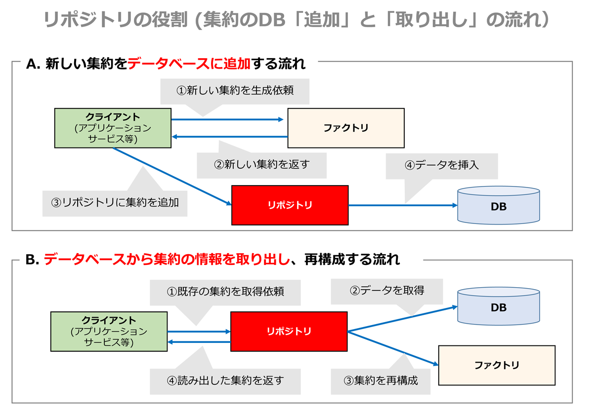
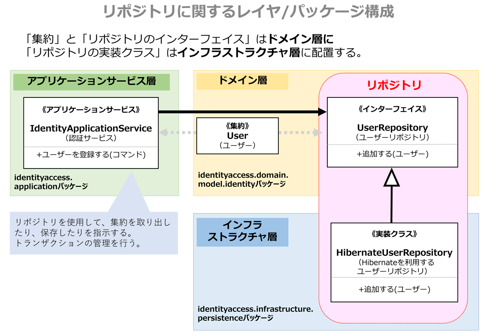
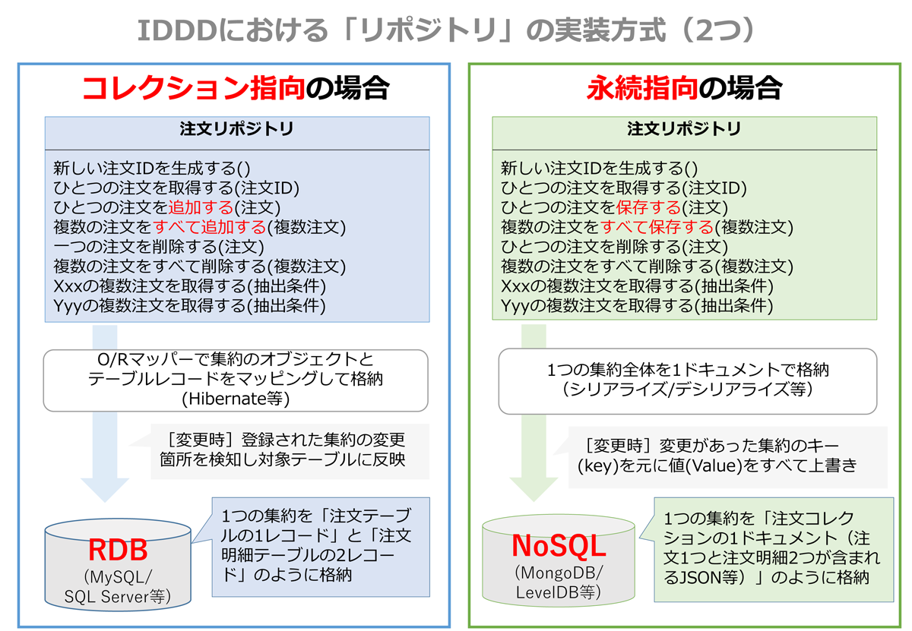

# リポジトリ

<!-- MarkdownTOC -->

- リポジトリとは
    - リポジトリで集約を操作する流れ
    - リポジトリとDAOの違い
    - リポジトリを利用する「アプリケーションサービス」
- リポジトリのモジュール構成
- データベースのトランザクション管理
- リポジトリの設計
    - コレクション指向のリポジトリ
    - 永続指向のリポジトリ

<!-- /MarkdownTOC -->


## リポジトリとは
DDDにおけるリポジトリは、**エンティティや値オブジェクトから構成される集約の<font color="blue">格納</font>と<font color="blue">取得</font>を担当します**

 - リポジトリは、クライアントへ集約を提供し、背後のデータベースとのやり取りを隠ぺいします。
 - 通常、集約とリポジトリの関係は一対一になる
    - 例えば「注文」の集約を利用したい場合「注文リポジトリ」を使用します
 - クライアント側はリポジトリのおかげで、物理的な構成（RDBなのか、NoSQLなのか等）を意識せずに、簡単に集約を操作できます

### リポジトリで集約を操作する流れ
リポジトリはデータベースにアクセスしたり、ファクトリを利用したりします。その流れを見てみましょう。



### リポジトリとDAOの違い
リポジトリは、データベースを操作するため、従来のDAO（データアクセスオブジェクト）と似ているかもしれません。しかし、DAOがデータ中心指向であるのに対して、リポジトリはオブジェクト指向アプローチである点で異なります。

そのため、DDDとしては「ドメインモデル」＋「リポジトリ」＋「データマッパー（Hibernate等）」との相性が良く、逆にDAOでは「トランザクションスクリプト」＋「テーブルモジュール」または「テーブルデータゲートウェイ」または「アクティブレコード」との相性が良いとIDDD本では紹介されています。

### リポジトリを利用する「アプリケーションサービス」
以下では、ユーザー管理のアプリケーションサービス（14章）にて、「ユーザー」の集約をデータベースに登録しています。
```java
// ■ユーザーIDに関するアプリケーションサービス
public class IdentityApplicationService {

    // ▼リポジトリ（SpringのDIにて設定）
    @Autowired
    private UserRepository userRepository;

    // ▼ユーザーを登録する（トランザクション宣言をアノテーション指定）
    @Transactional
    public User registerUser(RegisterUserCommand aCommand) {

        Tenant tenant = this.existingTenant(aCommand.getTenantId());

        // ユーザーの集約を生成（テナント集約のファクトリから生成）
        User user =
            tenant.registerUser(
                    aCommand.getInvitationIdentifier(),
                    aCommand.getUsername(),
                   ～中略～
                   )

        // ユーザーをリポジトリに登録
        this.userRepository().add(user);
        return user;
    }
```

---
## リポジトリのモジュール構成

 - リポジトリのインターフェイスは、集約と同じドメイン層のパッケージに配置
 - リポジトリの実装クラスはインフラ層に配置



こうすることで、「アーキテクチャ」で紹介したDIP原則に従うことで、ドメイン層への影響なく、リポジトリの交換が可能になりました。


## データベースのトランザクション管理
リポジトリではデータベースのトランザクション管理は行いません。そのため、**<font color="red">アプリケーションサービス側にてトランザクションを管理する必要があります</font>。


---
## リポジトリの設計
リポジトリの設計方法として以下の２つがあります。



### コレクション指向のリポジトリ
「コレクション指向のリポジトリ」では集約の登録時に「追加メソッド（Add）」を用います。

 - リポジトリは、登録された集約の情報をRDBに書き込みます
 - IDDDではO/Rマッパー（Hibernate等）の仕組みでオブジェクトの変更を検知し、複数のテーブルに反映します

**インターフェイスの設計**<br>
```java
// ■ユーザー集約を管理するリポジトリのインターフェイス
public interface UserRepository {

    // ▼リポジトリに追加
    public void add(User aUser);

    // ▼リポジトリから削除
    public void remove(User aUser);

    // ▼名前でユーザー集約を取得
    public User userWithUsername(
            TenantId aTenantId,
            String aUsername);
// ～中略～
}
```

**コレクション指向の実装クラス**<br>
```java
// ■ユーザー集約を管理するリポジトリの実装クラス
public class HibernateUserRepository
        extends AbstractHibernateSession implements UserRepository {

    // ▼リポジトリに追加
    @Override
    public void add(User aUser) {
        try {
            this.session().saveOrUpdate(aUser);
        } catch (ConstraintViolationException e) {
            throw new IllegalStateException("User is not unique.", e);
        }
    }

    // ▼リポジトリから削除
    @Override
    public void remove(User aUser) {
        this.session().delete(aUser);
    }

    // ▼名前でユーザー集約を取得
    @Override
    public User userWithUsername( TenantId aTenantId,  String aUsername) {
        Query query = this.session().createQuery(
"from com.saasovation.identityaccess.domain.model.identity.User as _obj_ "
 + "where _obj_.tenantId = ? "
 + "and _obj_.username = ?");
        query.setParameter(0, aTenantId);
        query.setParameter(1, aUsername, Hibernate.STRING);
        return (User) query.uniqueResult();
    }
// ～中略～
}
```


### 永続指向のリポジトリ
「永続指向のリポジトリ」では集約の作成／変更時に「保存メソッド（Save）」を用います。

 - リポジトリでは、保存メソッドが呼ばれたタイミングで、集約のキーを元に、NoSQLに保存します
 - 集約の階層構造を1つのデータ（ドキュメント）として保存します
 - そのため、差分的な変更ではなく、集約全体を一括で更新します

**インターフェイスの設計**<br>
```java
// ■プロダクト集約を管理するリポジトリ
public interface ProductRepository {

    // ▼プロダクト集約を取得（テナントID＋プロダクトID）
    public Product productOfId(TenantId aTenantId, ProductId aProductId);

    // ▼リポジトリに保存
    public void save(Product aProduct);

    // ▼リポジトリから削除
    public void remove(Product aProduct);
// ～中略～
}
```

**コレクション指向の実装クラス**<br>
```java
// ■LevelDBでの実装リポジトリ
public class LevelDBProductRepository
        extends AbstractLevelDBRepository implements ProductRepository {

    private static final String PRIMARY = "PRODUCT#PK";

    // ▼コンストラクタで、DBの場所として、コンテキスト名を使用
    public LevelDBProductRepository() {
        super(LevelDBDatabasePath.agilePMPath());
    }

    // ▼プロダクト集約を取得（テナントID＋プロダクトID）
    @Override
    public Product productOfId(TenantId aTenantId, ProductId aProductId) {
        // 取得に使うキーを設定する
        LevelDBKey primaryKey =
            new LevelDBKey(PRIMARY, aTenantId.id(), aProductId.id());
        Product product =
                LevelDBUnitOfWork.readOnly(this.database())
                    .readObject(primaryKey.key().getBytes(), Product.class);
        return product;
    }

    // ▼プロダクトをリポジトリに保存
    @Override
    public void save(Product aProduct) {
        LevelDBKey lockKey = new LevelDBKey(PRIMARY, aProduct.tenantId().id());
        LevelDBUnitOfWork uow = LevelDBUnitOfWork.current();
        uow.lock(lockKey.key());
        this.save(aProduct, uow);
    }
// ～中略～
}
```
