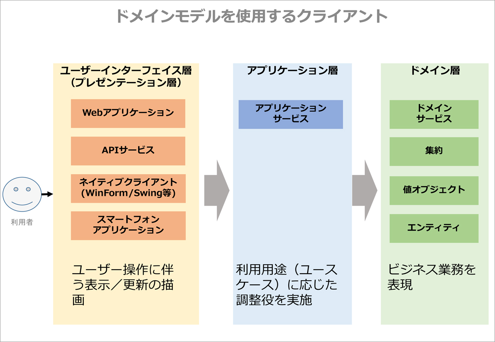
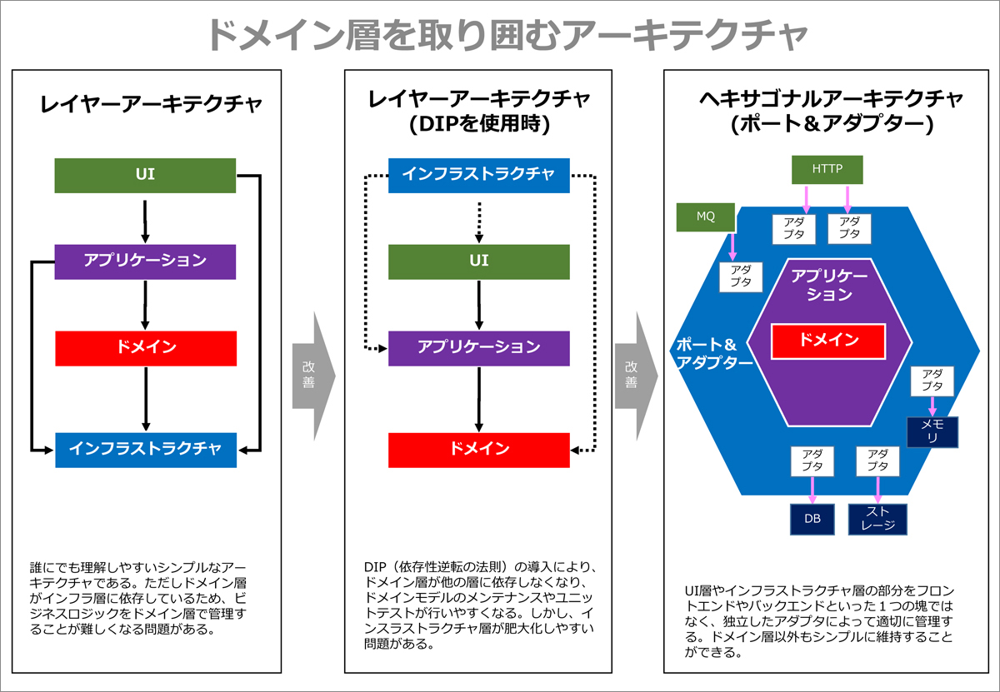
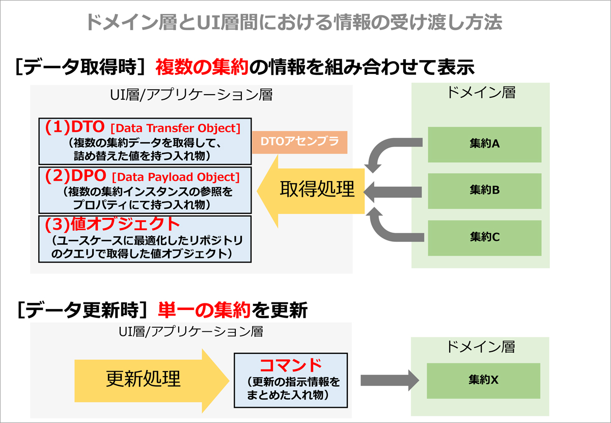
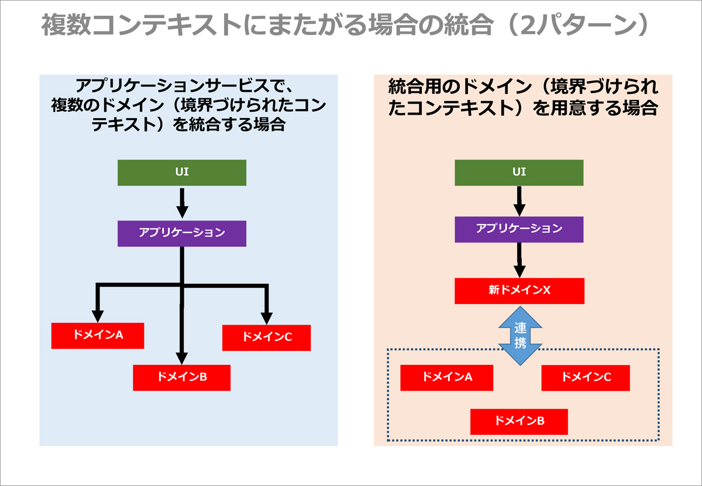
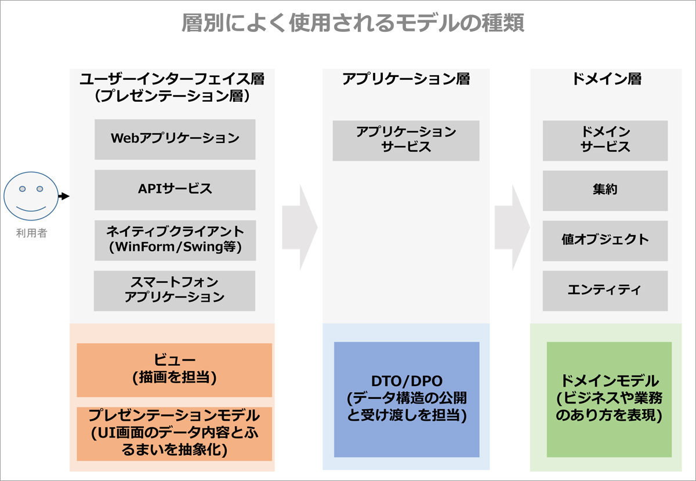

# アプリケーション

<!-- MarkdownTOC -->

- ドメインモデルを利用するアプリケーションとは
  - ドメインモデルを利用するアーキテクチャ
- ドメイン層とUI層間における情報の受け渡し方法
  - データ取得時
    - （1）複数の集約情報をDTOへ詰め替え
    - （2）複数の集約へ参照を保持するDPOを返送
    - （3）ユースケースに最適化したクエリによる取得
  - 複数クライアントに対応するための出力形式の切り替え
- 複数の境界づけられたコンテキストの統合・合成
- UI層での描画に関わるモデル
  - 「ビュー」と「プレゼンテーションモデル」
  - 様々なモデルの役割

<!-- /MarkdownTOC -->

## ドメインモデルを利用するアプリケーションとは
→「ユーザーインターフェイス層」「アプリケーション層」のこと

**ユーザーインターフェイス（UI層）** 
利用者に使い勝手の良いユーザーインターフェイスを提供するように努める層

**アプリケーション層（アプリケーションサービス）** 
アプリケーションサービスとはアプリケーション層に存在するドメインモデルのクライアントとなります。

 - アプリケーションサービスの責務は、タスクの調整であり、ユースケースのイベントフローごとにメソッドを提供します
 - アプリケーションサービスはあくまで調整役のため、薄い処理を行うだけのレイヤーとなります
 - アプリケーションサービスが調整する対象は、単一の境界づけられたコンテキストの場合もあれば、複数のコンテキストにまたがる場合もあります
 - データベースのトランザクションといったコントロールを行う場合もあります

### ドメインモデルを利用するアーキテクチャ

---
## ドメイン層とUI層間における情報の受け渡し方法
まず、ドメイン層の情報をどのようにUI層に受け渡すかについて整理してみましょう。

 - UI層で描画するデータを取得するためには「複数の集約」の情報を組み合わせる必要がある
 - 更新操作を行う場合にはUI層で入力された値を「1つの集約」に対して更新依頼することが一般的

### データ取得時
#### （1）複数の集約情報をDTOへ詰め替え
有名な方法として、複数の集約の情報を「データ転送オブジェクト(DTO)」に詰め替える方法

 1. まずアプリケーションサービスは、リポジトリ経由で複数の集約を取得します
 2. 次に、DTOを組み立てるクラスである「DTOアセンブラ（ValueObjectアセンブラ）を用いて、DTOに設定

この詰め替えを行うために、集約の保持する情報をDTOアセンブラに公開する必要があるかもしれません。これを避ける方法として、集約側に詰め替えメソッドを用意し、引数に渡されたDTO用オブジェクトへ詰め替えることも可能です。

#### （2）複数の集約へ参照を保持するDPOを返送
次の方法として、ヴァーノン氏が考えた「ドメインペイロードオブジェクト（DPO）」があります。ペイロードとは搭載物やデータ本体を指しますが、DPOでは集約そのものを指します。つまり、1つのDPOは複数の集約のインスタンスを保持し、レイヤー間で受け渡しします。

 - メリット :
    - 設計がシンプル
    - 詰め替えに伴うメモリ消費が小さい
 - デメリット :
    - DPOを利用するレイヤー（UI層）にドメインモデルを公開しなければいけない
    - 集約のプロパティに遅延ロード項目がある場合は事前にロードしておく必要があります

#### （3）ユースケースに最適化したクエリによる取得
最後の方法として、ユースケースで最適化したクエリをリポジトリに用意し、値オブジェクトを返す方法があります。

 1. リポジトリにファインダーメソッドを用意しておき、複数の集約を組み合わせたカスタムオブジェクトを返します
 2. その情報を（DTOではなく）値オブジェクトに設定して返します

あくまで、ユースケースのフローに特化したDTOではなく、業務ドメインに特化した値オブジェクトを用意するアプローチとなります。

### 複数クライアントに対応するための出力形式の切り替え
複数クライアントに向けた開発では、JSON形式やXML形式にて出力を分ける場合も多いと思います。こうした要望に対して、IDDD本では「データトランスフォーマ」と呼ばれる仕組みを用いて出力形式を切り替える方法を紹介しています

> 　例えば、カレンダーの週次情報を表示するシナリオの場合「CalendarWeekCSVDataTransformer」「CalendarWeekJSONDataTransformer」「CalendarWeekDTODataTransformer」のように欲しい形式名にて指定します。

ヘキサゴナルアーキテクチャのポート＆アダプター方式であれば、1つのポートに対して、出力フォーマット別にアダプターを実装するイメージとなります。この仕組みによってクライアントは、データトランスフォーマの型を指定してアプリケーションサービスを呼び出すことで、任意のデータ形式を取得できます。

---
## 複数の境界づけられたコンテキストの統合・合成
1つのUI画面にて、複数の境界づけられたコンテキストの情報が必要になる場合があります。例えば、3つのコンテキストをアプリケーションサービスでまとめる必要がある場合をみてみましょう。

大きく次の２つの方法があります。

最初の方法として、複数の境界づけられたコンテキストに対して、アプリケーション層からアクセスして合成する方法があります（上図左）。

次に、境界づけられたコンテキストを新しく作る方法があります（上図右）。このコアドメインは、新しいモデルと腐敗防止層から構成される軽量な役割となります。トランザクションスクリプトでもあり、ドメインモデル貧血症となりますが、そのようなコンテキストとして割り切ります。

どちらの方法を選ぶかという基準は、ビジネス上のメリットが大きいほうを選びます。以上、UI層からのリクエストに応じて、集約の情報を提供する方法を紹介してきました。

---
## UI層での描画に関わるモデル

### 「ビュー」と「プレゼンテーションモデル」
UIを描画するフレームワークはさまざまですが、

 - UIの表示（描画）を行う「ビュー」
 - UIの状態とUI固有ロジックを持つ「プレゼンテーションモデル」

の２つから構成されることがよくあります。この場合、プレゼンテーションモデルの状態に基づいてビューが画面のレンダリングを行います。

### 様々なモデルの役割

 - ドメインモデルはユビキタス言語を用いて、ビジネスや業務そのものを表現します
 - DTO/DPOはクライアントに対して、ユースケースに応じたデータ構造の公開と受け渡しを担当します
 - プレゼンテーションモデルは画面の内容を抽象化し、UI固有の振る舞いを担当するモデルとなります。そのため、画面に必要な機能をドメインモデルに実装するのではなく、プレゼンテーションモデルに用意するようにします。
 - プレゼンテーションモデルはUIのニーズに合わせたプロパティや振る舞いを持ち、必要な情報をドメインモデルから取得します。
    - RESTfulで提供するリソースも1つのプレゼンテーションモデルであるとヴァーノン氏は伝えています
